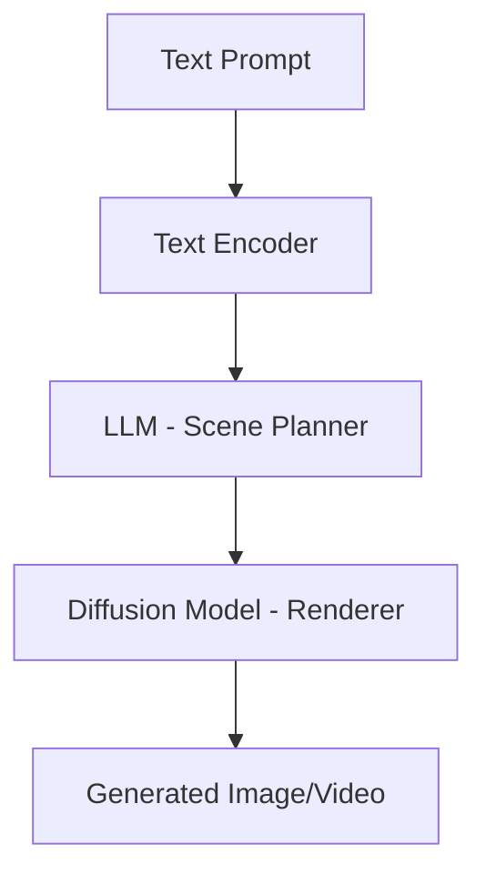
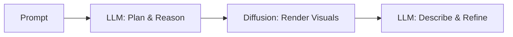

# 🎤 From Words to Worlds: How Diffusion Models Are Transforming Generation Beyond LLMs

## 📘 Session Abstract
This session explores how AI has evolved from thinking in words (LLMs) to dreaming in visuals (Diffusion Models), and how the future belongs to their fusion.  
We’ll unpack how these two architectures differ, how vectors work in each, and why hybrid multimodal systems like GPT‑4o, Gemini, and Sora are redefining generative AI.

---

## 🧭 Session Agenda
| Time | Topic |
|------|-------|
| 5 min | Warm-up / Intro: The evolution from text to visual intelligence |
| 10 min | How They Differ: LLMs are storytellers, Diffusion models are painters |
| 15 min | Internal Mechanism: Transformers vs Denoisers |
| 10 min | How Vectors Are Generated: Meaning space vs Appearance space |
| 15 min | Multimodal LLM vs Diffusion Models |
| 10 min | The Future: Unified multimodal architectures |
| 5 min | Conclusion + Q&A |

---

## 🌱 1. Warm-Up / Introduction

**Speaker Notes:**
- Begin by asking: “How many of you have used ChatGPT? Midjourney? Sora?”
- Explain: LLMs are the *brains* of AI — they think in words.  
  Diffusion models are the *imagination* — they dream in pictures and videos.
- Play short clips or show examples comparing GPT text vs Sora visuals.

---

## 🧩 2. How They Differ

| Feature | LLM (Transformer) | Diffusion Model (U‑Net + VAE) |
|----------|------------------|-------------------------------|
| Input | Text Tokens | Noise + Text Embeddings |
| Output | Text, Code | Images, Videos, Audio |
| Core Idea | Predict next word | Remove noise step‑by‑step |
| Architecture | Transformer | U‑Net + Variational Autoencoder |
| Training Data | Documents, code | Images, videos |
| Goal | Reasoning, planning | Visual realism |

**Analogy:**  
> LLMs are storytellers who write.  
> Diffusion models are painters who illustrate those stories.

**Mermaid Diagram:**


---

## ⚙️ 3. Internal Mechanism

### LLMs:
1. Break text into tokens.
2. Learn context and predict the next word.
3. Each token becomes a *vector* (meaningful number list).
4. Transformers stack many self-attention layers to reason.

**Metaphor:** a child completing sentences word‑by‑word.

### Diffusion Models:
1. Start with random noise.
2. Learn to *denoise* step‑by‑step.
3. Each step removes a bit of randomness guided by text embeddings.

**Metaphor:** watching fog clear from a window until the image appears.

---

## 🧠 4. How Vectors Are Generated

| Type | What it Represents | How It’s Used |
|------|--------------------|---------------|
| **LLM Vector** | Meaning of words (semantic) | Predict next tokens |
| **Diffusion Vector** | Appearance (latent pixels) | Guide denoising toward realism |

**Speaker Tip:** Show a 2D embedding plot—“dog” and “puppy” close together vs. “banana” far apart.

---

## 🎨 5. Multimodal LLM vs Diffusion Models

| Aspect | Multimodal LLM | Diffusion Model |
|---------|----------------|----------------|
| Understanding | Encodes pixels → embeddings | Decodes noise → pixels |
| Architecture | Transformer backbone | U‑Net denoiser |
| Output | Descriptions, reasoning | Visual renderings |
| Example | GPT‑4o, Gemini, Claude 3 | Sora, Runway Gen‑3, Stable Diffusion |

**Key Point:**  
A multimodal LLM *understands* images via vision encoders;  
a diffusion model *creates* them via denoising.

---

## 🚀 6. The Future and Enterprise Implications

- **Hybrid Systems:** Future AIs combine both — LLMs plan, Diffusion renders.  
- **Unified Token Space:** Same model can reason *and* visualize.  
- **Enterprise Value:** From AI documentation to digital twins and simulation agents.  
- **Architect Takeaway:** Learn both paradigms — language reasoning + visual rendering.

**Mermaid Overview:**


---

## 🧩 7. Conclusion + Q&A

**Summary:**
> LLMs think in words.  
> Diffusion models dream in pixels.  
> Together, they form the foundation of multimodal intelligence — the next leap in AI.

Encourage questions:
- “Where will diffusion impact your workflows?”
- “How might combining LLM + Diffusion unlock new products?”

---

## 💻 Appendix: Sample Diffusion Demo

```python
from diffusers import StableDiffusionPipeline
import torch

model_id = "runwayml/stable-diffusion-v1-5"
pipe = StableDiffusionPipeline.from_pretrained(model_id, torch_dtype=torch.float16)
pipe = pipe.to("cuda")

prompt = "A robot coding on a laptop in space, digital art"
image = pipe(prompt).images[0]
image.save("robot_in_space.png")
```

Run this in any environment with a GPU.  
It shows the full noise‑to‑image denoising pipeline.

---

## 🧩 Reference Materials
- OpenAI **Sora** whitepaper  
- Google **Gemini 2.0** research overview  
- Stability AI **Stable Diffusion 3**  
- Runway **Gen‑3 Alpha**  
- Hugging Face `diffusers` documentation

---

## 🧭 Final Takeaway
> “The next wave of AI will not just talk — it will show.”  
Learning diffusion models gives architects the power to move from **language to imagination**, from **words to worlds**.
