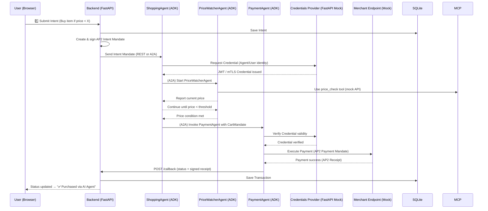

# 🧠 Agent Payments Protocol (AP2) – Demo Implementation Plan
**Title:** _Agentic Commerce with Google ADK, A2A Collaboration, MCP Tools, and AP2 Secure Payments_
**Audience:** IT Managers / Senior Engineering Leadership
**Presenter:** Praveen Yellamaraju

---
## 🔗 Reference URLs
- **AP2 Specification:** https://ap2-protocol.org/specification
- **Google ADK (Agent Development Kit):** https://google.github.io/adk-docs
- **A2A Protocol (Agent-to-Agent Collaboration):** https://a2a-protocol.org
- **Model Context Protocol (MCP):** https://modelcontextprotocol.io
- **Lightspark AP2 Overview:** https://www.lightspark.com/news/insights/agent-payments-protocol
- **VentureBeat Analysis:** https://venturebeat.com/ai/googles-new-agent-payments-protocol-ap2-allows-ai-agents-to-complete
- **Everest Group Blog:** https://www.everestgrp.com/blog/googles-agent-payments-protocol-ap2-a-new-chapter-in-agentic-commerce-blog

---
## 🧩 1. System Architecture Overview

**Core Components**

| Layer | Technology | Purpose |
|--------|-------------|----------|
| **UI Layer** | index.html (static) | Capture user intent & show status dashboard |
| **Backend API** | FastAPI (Python) | Issue, sign, and verify AP2 mandates; manage data |
| **Agent Engine** | Google ADK (Python) | Multi-agent ecosystem with A2A coordination |
| **Protocols** | A2A, MCP, AP2 | Agent collaboration, tool use, and secure payment |
| **Data Store** | SQLite | Persist mandates, intents, receipts |
| **Credentials Provider (Mock)** | FastAPI microservice | Simulated credential issuance/verification |
| **Merchant Endpoint (Mock)** | FastAPI microservice | Receives signed AP2 payment requests |

---
## 🧱 2. High-Level Flow (Architecture Diagram)



---
## ⚙️ 3. Component Responsibilities

| Component | Responsibilities |
|------------|------------------|
| **Frontend (index.html)** | UI for intent entry & live transaction status |
| **FastAPI Backend** | Sign mandates, issue agent requests, persist transactions |
| **Google ADK Agents** | Execute modular workflows: Shopping, Price Watch, Payment |
| **A2A Protocol** | Agent collaboration (Shopping↔Price↔Payment) |
| **MCP Tools** | Provide specialized functions (price lookup, database writes, logging) |
| **Credentials Provider (Mock)** | Issue/verifies credentials simulating long-term AP2 trust |
| **Merchant Endpoint (Mock)** | Accepts signed AP2 requests, verifies & responds with receipts |
| **SQLite** | Persistent storage for mandates, receipts, and audit logs |

---
## 🔐 4. Compliance with AP2 Specification

| AP2 Spec Section | Implementation |
|------------------|----------------|
| **§3.1 – Actors** | User (UI), Shopping Agent (ADK), Merchant (Mock), Processor (Backend), Credentials Provider (Mock) |
| **§3.2 – Mandate Types** | JSON-LD mandates: Intent, Cart, Payment |
| **§3.2.2 – Long Term Identity** | Mock Credentials Provider with JWT/mTLS |
| **§4.1–4.3 – Message Exchange** | Signed JSON-LD messages per AP2 spec |
| **§5 – Security** | ECDSA signing, JWT verification, simulated mTLS |
| **§6 – Provenance** | Signed receipts stored in SQLite for traceability |

---
## 📂 5. Folder Structure

```
ap2_demo/
├── frontend/
│   └── index.html
│
├── backend/
│   ├── main.py
│   ├── db.py
│   ├── models.py
│   ├── routes/
│   │   ├── intent.py
│   │   ├── mandate.py
│   │   ├── payment.py
│   │   └── callback.py
│   ├── utils/
│   │   ├── signer.py
│   │   ├── verifier.py
│   │   └── ap2_payloads.py
│   └── requirements.txt
│
├── agents/
│   ├── shopping_agent.py
│   ├── price_watcher_agent.py
│   ├── payment_agent.py
│   ├── mcp_tools/
│   │   ├── price_check_tool.py
│   │   ├── db_writer_tool.py
│   │   └── logger_tool.py
│   ├── a2a_config.yaml
│   ├── ap2_mandates.py
│   └── requirements.txt
│
├── services/
│   ├── credentials_provider.py
│   └── merchant_mock.py
│
├── database/
│   └── ap2_demo.db
│
├── docker-compose.yml
└── README.md
```

---
## 🧩 6. Implementation Phases

| Phase | Deliverable | Description |
|--------|--------------|-------------|
| **1. Setup** | Backend + Frontend scaffold | FastAPI + SQLite ORM + static HTML |
| **2. Mandate Flow** | Create IntentMandate, sign/verify | Simulate ECDSA digital signatures |
| **3. Agent Orchestration** | ShoppingAgent ↔ PriceWatcher ↔ PaymentAgent | Use Google ADK SDK + A2A configuration |
| **4. MCP Tools** | Add price_check_tool.py & logger_tool.py | Mock product price lookup |
| **5. AP2 Integration** | Implement signed JSON-LD exchanges | Conform to §4 AP2 message format |
| **6. Credential Provider** | Mock FastAPI microservice | JWT & mTLS issuance per §3.2.2 |
| **7. Merchant Endpoint** | Mock merchant API | Validates AP2 signatures, issues receipts |
| **8. End-to-End Flow** | UI → Backend → Agents → Merchant | Complete AP2 transaction loop |
| **9. Analytics (Optional)** | Dashboard or Power BI | Visualize agent and mandate events |

---
## 💾 7. Example Mandates

**IntentMandate**
```json
{
  "@type": "IntentMandate",
  "user": "user@gmail.com",
  "agent": "shopping_agent",
  "intent": "buy 'Book A' if price < 20 EUR",
  "timestamp": "2025-10-24T06:00Z",
  "signature": "base64-ecdsa-sig"
}
```

**CartMandate**
```json
{
  "@type": "CartMandate",
  "intent_ref": "intent_123",
  "items": [{"product": "Book A", "price": 18}],
  "approved_by": "shopping_agent",
  "signature": "base64-ecdsa-sig"
}
```

**PaymentMandate**
```json
{
  "@type": "PaymentMandate",
  "cart_ref": "cart_123",
  "merchant": "mock_merchant_1",
  "amount": 18,
  "currency": "EUR",
  "agent_credential": "jwt-token",
  "signature": "base64-ecdsa-sig"
}
```

---
## 🔐 8. Security & Trust Framework

| Aspect | Implementation | Spec Alignment |
|--------|----------------|----------------|
| Identity Assertion | Credentials Provider (FastAPI mock) issues JWT tokens | AP2 §3.2.2 |
| Agent & Merchant Verification | mTLS or JWT token validation | HTTPS + cert chain |
| Digital Signatures | ECDSA (P-256) | AP2 §5 |
| Provenance | Signed receipts logged in SQLite | AP2 §6 |
| Data Privacy | No personal info persisted | Demonstration-safe |

---
## 🧮 9. Demo Storyline (For Presentation)

Scenario: “Buy Book A if the price drops below €20.”
1. User submits intent via UI.
2. Backend issues AP2 IntentMandate (signed).
3. ADK ShoppingAgent receives it → launches PriceWatcherAgent via A2A.
4. PriceWatcher uses MCP tool to monitor mock API.
5. When condition met, PaymentAgent constructs PaymentMandate.
6. PaymentAgent sends signed AP2 request to Merchant Endpoint.
7. Merchant verifies signature & credential (simulated JWT).
8. Merchant issues AP2-compliant receipt.
9. Backend updates UI: “✅ Purchased via AI Agent”.

---
## 📈 10. Future Enhancements

- Replace SQLite with PostgreSQL or Cloud SQL.
- Integrate with Stripe or Razorpay sandbox for real payments.
- Add OIDC (Google Identity / Azure AD) to Credentials Provider.
- Implement observability via OpenTelemetry and Grafana.
- Expand A2A workflows (refund, cancel, multi-agent negotiation).
- Add RAG pipeline for contextual reasoning.

---
## 🧩 11. Key Takeaways

- Demonstrates real AP2 protocol compliance (Actors, Mandates, Security).
- Built using open agentic stack (ADK + A2A + MCP + AP2).
- Designed for enterprise-grade AI showcases.
- Fully runnable locally, no external dependencies.

---
✅ End of Document
