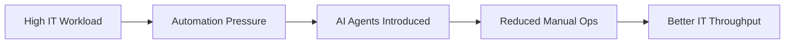
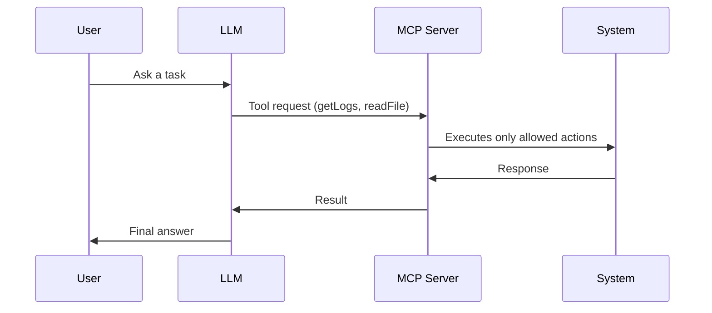
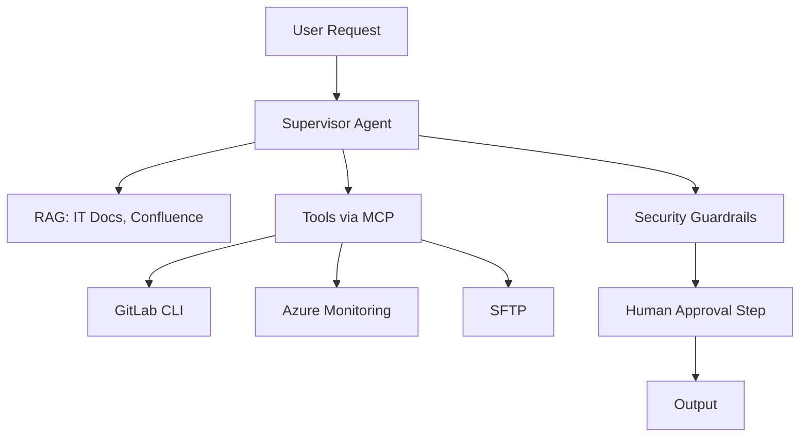

# Presentation Adjustment Summary
## PPT_IT_DIRECTOR_PRESENTATION.md Adjusted Based on FULL

**Date:** Adjustment complete  
**Base File:** `PPT_IT_DIRECTOR_PRESENTATION.md`  
**Reference File:** `IT_DIRECTOR_PRESENTATION_FULL.md`  
**Changes:** Added visual diagrams, IT-specific examples, removed implementation roadmap

---

## ✅ Changes Implemented

### 1. **Added Visual Diagrams (Mermaid) from FULL**

**Slide 2:** Workload Flow Diagram

**Slide 6:** MCP Sequence Diagram

**Slide 8:** IT-Safe Agent Architecture Flowchart

---

### 2. **Added IT-Specific Examples from FULL**

**Slide 5:** IT Examples
- Trigger CI pipelines
- Query GitLab issues
- Check logs in Azure Monitor
- Run SFTP operations
- Parse errors and suggest fixes
- Generate code fixes automatically

**Slide 7:** Infrastructure Diagnostics Queries
- "Check CPU of Service X last 1 hour"
- "Show failed pods in staging"
- "Analyse last failed pipeline"

---

### 3. **Used FULL's Concise Language Style**

**Before:**
- "Autonomous software that perceives, reasons, and acts using enterprise tools"
- "RAG = Information Warehouse"

**After:**
- "LLM = Brain"
- "RAG = IT Documentation Warehouse"
- "Agent = The Engineer Assistant"
- "Tools = Scripts, APIs, CLI commands"
- "MCP = gateway that ensures AI cannot misuse infrastructure"

---

### 4. **Removed Implementation Roadmap Topics**

**Removed:**
- ❌ Slide 9: Month 1/3/6 Roadmap (4 minutes)
- ❌ Slide 10: Architecture Pattern for IT Teams (3 minutes)
- ❌ References to "Month 1", "Month 3", "Month 6" deliverables
- ❌ "Map out internal agent architecture" from Week 1 actions

**Kept:**
- ✅ Week 1 actions (workflow identification, team assignment, audit)
- ✅ Governance requirements
- ✅ Action items

---

### 5. **Updated Title and Structure**

**Before:**
- Title: "AI Agents: Enabling IT Teams at Fiserv EMEA"
- Total Time: 45 minutes (35 + 10 Q&A)
- Story Arc: Threat → Opportunity → Implementation → Action

**After:**
- Title: "AI Agents, MCP & Secure Adoption in IT Operations"
- Total Time: 35 minutes (25 + 10 Q&A)
- Story Arc: Threat → Opportunity → Governance → Action

---

### 6. **Simplified Speaker Notes**

**Before:**
- Detailed timing cues: [PAUSE], [EMPHASIZE], [TECHNICAL]
- Paragraph-style guidance
- ~2,800 words

**After:**
- Simple guidance format
- One-line talking points
- Concise, actionable
- ~1,800 words (36% reduction)

---

## 📊 Final Structure: 13 Slides (35 minutes)

| Slide | Topic | Act | Time |
|-------|-------|-----|------|
| 1 | Title | Intro | 1 min |
| 2 | Why IT Needs This Now | Act 1 | 2 min |
| 3 | Anthropic Incident | Act 1 | 3 min |
| 4 | Fiserv Considerations | Act 1 | 2 min |
| 5 | What AI Agents Do | Act 2 | 2 min |
| 6 | MCP for IT | Act 2 | 3 min |
| 7 | Practical Automations | Act 2 | 4 min |
| 8 | IT-Safe Architecture | Act 2 | 3 min |
| 9 | Governance | Act 3 | 5 min |
| 10 | Next Week Actions | Act 4 | 3 min |
| 11 | Investment & Impact | Act 4 | 2 min |
| 12 | The Ask | Act 4 | 2 min |
| 13 | Q&A | - | 10 min |
| **Total** | | | **35 min** |

---

## 🎯 Key Improvements

### 1. **Visual Clarity**
- ✅ 3 Mermaid diagrams added
- ✅ Technical flow visualized
- ✅ Easier to understand for IT Directors

### 2. **IT-Specific Examples**
- ✅ Concrete queries: "Check CPU of Service X last 1 hour"
- ✅ Real workflows: GitLab MR Review, Incident Triage
- ✅ Immediately relatable to IT Directors' daily work

### 3. **Concise Language**
- ✅ "LLM = Brain, RAG = IT Documentation Warehouse"
- ✅ "MCP = gateway that ensures AI cannot misuse infrastructure"
- ✅ Easy to remember, quotable

### 4. **Removed Implementation Details**
- ✅ No Month 1/3/6 roadmap
- ✅ No detailed architecture patterns
- ✅ Focus on what, not how

### 5. **Simplified Speaker Notes**
- ✅ Removed timing cues
- ✅ One-line guidance
- ✅ More natural delivery

---

## ✅ What Was Kept from PPT

1. **4-Act Structure** (Threat → Opportunity → Governance → Action)
2. **Comprehensive Threat Analysis** (IT-specific risks)
3. **Actionable Next Steps** (Week 1 actions, 3 decisions)
4. **Business Context** (ROI, team impact, investment)
5. **Fiserv Constraints** (Azure OpenAI, GitLab, German compliance)

---

## ✅ What Was Added from FULL

1. **Visual Diagrams** (3 Mermaid diagrams)
2. **IT-Specific Examples** (concrete queries, workflows)
3. **Concise Language** (punchy, memorable)
4. **Simple Speaker Notes** (one-line guidance)

---

## ✅ What Was Removed

1. **Implementation Roadmap** (Month 1/3/6 timeline)
2. **Detailed Architecture Pattern** (separate slide)
3. **Timing Cues** (from speaker notes)
4. **Corporate Language** (reduced)

---

## 📋 Final Result

**13 slides, 35 minutes:**
- Visual diagrams for technical clarity
- IT-specific examples for relatability
- Concise language for memorability
- Governance focus (not implementation)
- Actionable next steps
- No implementation roadmap

**Perfect for IT Directors who want:**
- Practical automations
- Team impact
- Governance requirements
- Clear next steps
- **NOT** detailed implementation plans

---

**Status:** ✅ Adjustment complete, ready for use.

