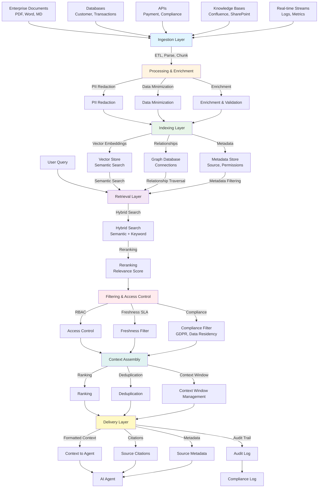

# Context Engineering Architecture Diagram

## Location
The diagram is in: `markdown/07_Context_Engineering.md` (lines 67-139)

## Mermaid Diagram Code



## How to View/Use This Diagram

### Option 1: Online Mermaid Renderer
1. Copy the Mermaid code above (between the ```mermaid tags)
2. Go to: https://mermaid.live/
3. Paste the code
4. The diagram will render automatically
5. You can export as PNG, SVG, or PDF

### Option 2: VS Code
1. Install the "Markdown Preview Mermaid Support" extension
2. Open `07_Context_Engineering.md`
3. The diagram will render in the preview

### Option 3: GitHub/GitLab
- If you push to GitHub/GitLab, Mermaid diagrams render automatically in markdown files

### Option 4: PowerPoint
1. Render the diagram using mermaid.live
2. Export as PNG or SVG
3. Insert into PowerPoint slide 10

## Architecture Layers Explained

1. **Data Sources (Blue)**: Enterprise documents, databases, APIs, knowledge bases, real-time streams
2. **Ingestion (Light Blue)**: ETL, parsing, chunking, metadata extraction
3. **Processing (Light Orange)**: PII redaction, data minimization, enrichment
4. **Indexing (Green)**: Vector store, graph database, metadata store
5. **Retrieval (Purple)**: Hybrid search, reranking
6. **Filtering (Red)**: Access control, freshness, compliance
7. **Assembly (Teal)**: Ranking, deduplication, context window
8. **Delivery (Yellow)**: Formatted context, citations, audit trail

## For PowerPoint

**Recommended Approach:**
1. Use https://mermaid.live/ to render the diagram
2. Export as high-resolution PNG (for better quality in PPT)
3. Or export as SVG (scalable, can edit colors in PowerPoint)
4. Insert into Slide 10 as the main visual

**Alternative:** Use PowerPoint's SmartArt or create a simplified version using shapes if Mermaid rendering isn't available.

