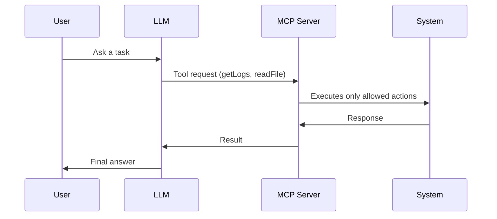
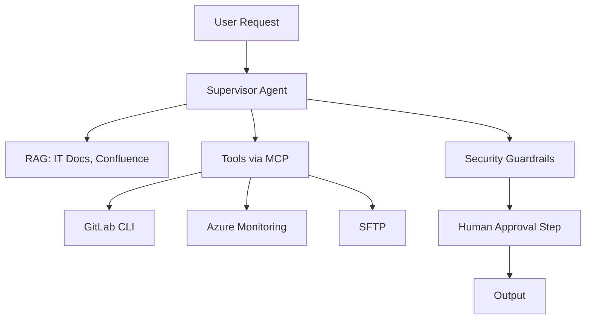

# AI Agents & Governance — IT Director Edition

## Slide 1: Title  
# **AI Agents, MCP & Secure Adoption in IT Operations**  
### Practical Guide for IT Managers & IT Directors  
(Designed for technical leadership, not executives)

---

## Slide 2: Why IT Needs This Now  
- Workloads increasing (tickets, builds, incidents, CI/CD pipelines)  
- AI is already embedded in tools: VS Code, GitLab, Azure OpenAI  
- Competing organisations are automating IT workflows aggressively  
- IT teams need **efficiency**, not more tools  
- Agentic AI can remove 30–50% manual effort in:  
  - Ticket triage  
  - Code review  
  - Environment provisioning  
  - Incident correlation  
  - Runbook automation  

**Mermaid Diagram:**  

---

## Slide 3: What AI Agents Actually Do  
### Plain language  
**LLM = Brain**  
**RAG = IT Documentation Warehouse**  
**Agent = The Engineer Assistant**  
**Tools = Scripts, APIs, CLI commands**

### IT Examples  
- Trigger CI pipelines  
- Query GitLab issues  
- Check logs in Azure Monitor  
- Run SFTP operations  
- Parse errors and suggest fixes  
- Generate code fixes automatically  

---

## Slide 4: MCP (Model Context Protocol) for IT  
### Why IT Directors Should Care  
- MCP turns LLMs into **safe**, **controlled**, **auditable** engineering assistants.  
- IT can expose **limited, permissioned tools** to AI.  
- Perfect for internal tools where compliance matters.

### How MCP Works in IT  

MCP = gateway that ensures AI cannot misuse infrastructure.

---

## Slide 5: Practical IT Automations (Realistic)  
### 1. **Automated MR Review (GitLab)**  
- Linting  
- Security scanning  
- Review summary  
- Suggested code patches  

### 2. **Incident Triage**  
- Summarise logs from multiple systems  
- Suggest likely root cause  
- Propose runbook steps  

### 3. **Infrastructure Diagnostics**  
- “Check CPU of Service X last 1 hour”  
- “Show failed pods in staging”  
- “Analyse last failed pipeline”  

### 4. **ITSM Ticket Processing**  
- Classify incidents  
- Prioritise  
- Suggest resolutions  
- Auto-close duplicate tickets  

---

## Slide 6: Architecture of an IT-Safe Agent  

**All tool actions are permission-bound.**

---

## Slide 7: Where Anthropic’s AI-Espionage Incident Matters to IT  
### Simple takeaway  
Attackers used an agentic model to:  
- Scan networks  
- Generate exploits  
- Move laterally  
- Extract credentials  
- Exfiltrate data  
*Automatically*.

### IT Implication  
- Our AI agents must **never** have uncontrolled tool access.  
- We must enforce:  
  - Sandboxed actions  
  - Read-only by default  
  - No “hidden subtasks”  
  - Mandatory human approval  
  - Logging of all agent operations

---

## Slide 8: Fiserv-Relevant Considerations  
### IT stack realities  
- Azure OpenAI (primary)  
- Internal proxies → no external network calls  
- GitLab pipelines for DevOps  
- Azure Monitor / Elastic / Splunk for logs  
- ITSM tool integrations (ServiceNow / Jira)

### Implication  
All examples given must operate **within these constraints**, making MCP ideal.

---

## Slide 9: Governance IT Directors Must Implement  
- Approve safe tool sets  
- Define privilege model for agents  
- Enforce context engineering standards  
- Log every tool action by the agent  
- Enforce read-only mode except in approved pipelines  
- Red-team agents (try jailbreak prompts)  
- Train IT teams on prompt/context safety  

---

# Speaker Notes (IT Director Edition)

## Slide 1 Notes  
“Today is about enabling IT teams to use AI agents safely and productively. Not high-level strategy — real workflows.”

## Slide 2 Notes  
“Your teams are overloaded. AI agents directly reduce workload in ops, DevOps, monitoring, and ITSM. Competitors are already doing this.”

## Slide 3 Notes  
“Explain simply — no deep maths. Emphasise that these are engineering assistants, not magic.”

## Slide 4 Notes  
“MCP is your safety barrier. It’s essentially RBAC for AI. Directors love hearing 'controlled' and 'auditable'.”

## Slide 5 Notes  
“These are not hypothetical. These can be implemented in 30 days with current tools.”

## Slide 6 Notes  
“Show that everything is controlled. Directors worry about AI running wild — reassure them.”

## Slide 7 Notes  
“Use the incident to highlight why governance matters. Don’t scare — educate.”

## Slide 8 Notes  
“Make it Fiserv-specific. They care about internal constraints.”

## Slide 9 Notes  
“End with actions they must take. IT Directors need clear next steps.”

