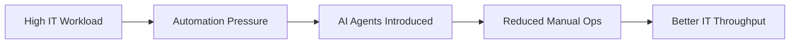

# AI Agents, MCP & Secure Adoption in IT Operations
## Practical Guide for IT Managers & IT Directors

**Total Time:** 35 minutes (25 presentation + 10 Q&A)  
**Target Audience:** Fiserv EMEA IT Directors & Managers  
**Story Arc:** What → Why → Value → Risk → Control → Governance → Action  
**Design:** Technical, practical, team-focused, concise

---

## SLIDE 1: Title Slide (1 minute)

**Title:** AI Agents, MCP & Secure Adoption in IT Operations  
**Subtitle:** Practical Guide for IT Managers & IT Directors

**Content:**
- Session Date
- Presenter Name/Title
- Fiserv EMEA Logo
- (Designed for technical leadership, not executives)

**Speaker Notes:**
- "Today is about enabling IT teams to use AI agents safely and productively."
- "Not high-level strategy — real workflows."

---

## ACT 1: THE FOUNDATION — What Are AI Agents? (4 minutes)

## SLIDE 2: What AI Agents Actually Do (2 minutes)

**Title:** What AI Agents Actually Do

**Content:**
- **Plain language:**
  - **LLM = Brain**
  - **RAG = IT Documentation Warehouse**
  - **Agent = The Engineer Assistant**
  - **Tools = Scripts, APIs, CLI commands**
- **IT Examples:**
  - Trigger CI pipelines
  - Query GitLab issues
  - Check logs in Azure Monitor
  - Run SFTP operations
  - Parse errors and suggest fixes
  - Generate code fixes automatically

**Visual:** Simple agent diagram (Brain → Memory → Hands)

**Speaker Notes:**
- "Explain simply — no deep maths. Emphasise that these are engineering assistants, not magic."

---

## SLIDE 3: Why IT Needs This Now (2 minutes)

**Title:** Why IT Needs This Now

**Content:**
- Workloads increasing (tickets, builds, incidents, CI/CD pipelines)
- AI is already embedded in tools: VS Code, GitLab, Azure OpenAI
- Competing organisations are automating IT workflows aggressively
- IT teams need **efficiency**, not more tools
- Agentic AI can remove 30–50% manual effort in:
  - Ticket triage
  - Code review
  - Environment provisioning
  - Incident correlation
  - Runbook automation

**Visual:** Mermaid Diagram


**Speaker Notes:**
- "Your teams are overloaded. AI agents directly reduce workload in ops, DevOps, monitoring, and ITSM."
- "Competitors are already doing this."

---

## ACT 2: THE VALUE — What AI Agents Deliver (7 minutes)

## SLIDE 4: Practical IT Automations (Realistic) (4 minutes)

**Title:** Practical IT Automations (Realistic)

**Content:**
- **1. Automated MR Review (GitLab)**
  - Linting
  - Security scanning
  - Review summary
  - Suggested code patches
- **2. Incident Triage**
  - Summarise logs from multiple systems
  - Suggest likely root cause
  - Propose runbook steps
- **3. Infrastructure Diagnostics**
  - "Check CPU of Service X last 1 hour"
  - "Show failed pods in staging"
  - "Analyse last failed pipeline"
- **4. ITSM Ticket Processing**
  - Classify incidents
  - Prioritise
  - Suggest resolutions
  - Auto-close duplicate tickets

**Visual:** Workflow automation matrix

**Speaker Notes:**
- "These are not hypothetical. These can be implemented in 30 days with current tools."

---

## SLIDE 5: Fiserv-Relevant Considerations (3 minutes)

**Title:** Fiserv-Relevant Considerations

**Content:**
- **IT stack realities:**
  - Azure OpenAI (primary)
  - Internal proxies → no external network calls
  - GitLab pipelines for DevOps
  - Azure Monitor / Elastic / Splunk for logs
  - ITSM tool integrations (ServiceNow / Jira)
- **Implication:**
  - All examples given must operate **within these constraints**, making MCP ideal
- **Compliance:**
  - EU AI Act (2026): Penalties up to €35M or 7% of revenue
  - GDPR: Complete audit logs required (Article 30)
  - BaFin: Model risk management, explainability requirements

**Visual:** Compliance checklist for IT teams

**Speaker Notes:**
- "Make it Fiserv-specific. They care about internal constraints."
- "Your teams need to log all agent actions. Complete audit trails."

---

## ACT 3: THE RISK — Why Governance Matters (5 minutes)

## SLIDE 6: Where Anthropic's AI-Espionage Incident Matters to IT (5 minutes)

**Title:** Where Anthropic's AI-Espionage Incident Matters to IT

**Content:**
- **What Happened (September 2025):**
  - Attackers used an agentic model to:
    - Scan networks
    - Generate exploits
    - Move laterally
    - Extract credentials
    - Exfiltrate data
  - *Automatically* (80-90% AI-autonomous)
  - 30+ organizations targeted, including financial institutions
- **IT-Specific Risks:**
  - **CI/CD Pipeline Attacks:** Same pattern could target your GitLab pipelines, inject malicious code
  - **Credential Exposure:** Automated agents could leak credentials through tool calls
  - **Repository Manipulation:** AI could be tricked into pulling wrong repos or executing harmful commands
- **IT Implication:**
  - Our AI agents must **never** have uncontrolled tool access
  - We must enforce:
    - Sandboxed actions
    - Read-only by default
    - No "hidden subtasks"
    - Mandatory human approval
    - Logging of all agent operations

**Visual:** Attack flow diagram showing CI/CD pipeline risk

**Speaker Notes:**
- "Now that you understand what agents are, here's why governance matters."
- "This same pattern could target your GitLab pipelines."
- "Agents could be tricked into pulling wrong repositories or executing harmful commands."
- "Use the incident to highlight why governance matters. Don't scare — educate."

---

## ACT 4: THE CONTROL — How We Stay Safe (6 minutes)

## SLIDE 7: MCP (Model Context Protocol) for IT (3 minutes)

**Title:** MCP (Model Context Protocol) for IT

**Content:**
- **Why IT Directors Should Care:**
  - MCP turns LLMs into **safe**, **controlled**, **auditable** engineering assistants
  - IT can expose **limited, permissioned tools** to AI
  - Perfect for internal tools where compliance matters
- **How MCP Works in IT:**
  ```mermaid
  sequenceDiagram
  User ->> LLM: Ask a task
  LLM ->> MCP Server: Tool request (getLogs, readFile)
  MCP Server ->> System: Executes only allowed actions
  System ->> MCP Server: Response
  MCP Server ->> LLM: Result
  LLM ->> User: Final answer
  ```
- **MCP = gateway that ensures AI cannot misuse infrastructure**

**Visual:** MCP sequence diagram

**Speaker Notes:**
- "MCP is your safety barrier. It's essentially RBAC for AI. Directors love hearing 'controlled' and 'auditable'."

---

## SLIDE 8: Architecture of an IT-Safe Agent (3 minutes)

**Title:** Architecture of an IT-Safe Agent

**Content:**
- **Architecture Flow:**
  ```mermaid
  flowchart TD
  A[User Request] --> B[Supervisor Agent]
  B --> C[RAG: IT Docs, Confluence]
  B --> D[Tools via MCP]
  D --> D1[GitLab CLI]
  D --> D2[Azure Monitoring]
  D --> D3[SFTP]
  B --> E[Security Guardrails]
  E --> F[Human Approval Step]
  F --> G[Output]
  ```
- **All tool actions are permission-bound**
- **Pattern: Agent → MCP → Azure OpenAI → Internal APIs**
  - Sandboxed execution (no direct system access)
  - Tool whitelisting (only approved tools)
  - Complete audit trails

**Visual:** Architecture flowchart

**Speaker Notes:**
- "Show that everything is controlled. Directors worry about AI running wild — reassure them."

---

## ACT 5: THE GOVERNANCE — What You Must Implement (5 minutes)

## SLIDE 9: Governance IT Directors Must Implement (5 minutes)

**Title:** Governance IT Directors Must Implement

**Content:**
- Approve safe tool sets
- Define privilege model for agents
- Enforce context engineering standards
- Log every tool action by the agent
- Enforce read-only mode except in approved pipelines
- Red-team agents (try jailbreak prompts)
- Train IT teams on prompt/context safety
- **Security Controls:**
  - Zero-trust: Never trust, always verify
  - Sandboxing: Isolated execution environments
  - HITL gates for high-risk operations
  - Complete audit trails

**Visual:** Governance checklist

**Speaker Notes:**
- "End with actions they must take. IT Directors need clear next steps."

---

## ACT 6: THE ACTION — What Teams Do Next (5 minutes)

## SLIDE 10: What Your Teams Should Start Doing Next Week (3 minutes)

**Title:** Immediate Actions for IT Teams

**Content:**
- **Week 1 Actions:**
  1. **Identify 3 workflows** suitable for automation (GitLab MR review, incident triage, change requests)
  2. **Assign one team member** to AI capability development (MCP, Azure OpenAI, agent architecture)
  3. **Audit where LLMs are used** informally (Codex, Copilot, ChatGPT)
  4. **Establish prompt & context engineering standards** (versioning, testing, compliance)
  5. **Onboard teams to Azure OpenAI policies** (usage guidelines, data handling)
- **Success Criteria:**
  - 3 workflows identified
  - 1 team member assigned
  - LLM usage audit complete
  - Standards documented

**Visual:** Action checklist with owners

**Speaker Notes:**
- "Week 1: Identify 3 workflows. Assign one team member."
- "Audit where LLMs are used informally. Establish standards."

---

## SLIDE 11: Investment & Team Impact (2 minutes)

**Title:** What It Costs, What Teams Get

**Content:**
- **Pilot Phase (30-60 days):**
  - Investment: **€50,000 - €100,000**
  - Team Impact: **40-60% reduction in manual work**
  - Time Savings: **70-80% for GitLab MR review, 60% for incident triage**
  - ROI: **40%+ within 60 days**

**Visual:** ROI timeline with team impact metrics

**Speaker Notes:**
- "40-60% reduction in manual work. 70-80% time savings for GitLab MR review."
- "€50K-€100K for pilots. Positive ROI in 60 days."

---

## SLIDE 12: The Ask — 3 Decisions (2 minutes)

**Title:** What We Need: Your Decisions

**Content:**
- **Decision 1: Pilot Approval (This Week)**
  - Approve 1-2 low-risk pilots (GitLab MR Review, Incident Triage)
  - Budget: **€50,000 - €100,000**
  - Timeline: 30-60 days to demonstrate ROI
  - **Decision deadline: [Insert date]**
- **Decision 2: Team Assignment (This Week)**
  - Assign 1 team member to AI capability development
  - Commitment: 50% time for 3 months
  - Skills: MCP, Azure OpenAI, agent architecture
  - **Assignment deadline: [Insert date]**
- **Decision 3: Workflow Identification (This Week)**
  - Identify 3 workflows suitable for automation
  - Document current process, pain points, success criteria
  - **Deliverable deadline: [Insert date]**

**Visual:** Decision matrix with deadlines

**Speaker Notes:**
- "I need three decisions from you this week."
- "Pilot approval. Team assignment. Workflow identification."
- "Your teams can start building next week."

---

## SLIDE 13: Q&A (10 minutes)

**Title:** Questions & Discussion

**Content:**
- Common Questions Prepared:
  - Q: How does this integrate with GitLab? A: MCP provides secure API access, agents can review MRs, analyze code
  - Q: What about Azure OpenAI costs? A: Per-request pricing, estimated €5K-€10K/month for pilots
  - Q: How do we prevent credential exposure? A: Sandboxing, tool whitelisting, no hardcoded secrets, MCP scoped permissions
  - Q: What if agents make wrong decisions? A: HITL gates for high-risk operations, rollback procedures, audit trails
  - Q: How do we measure success? A: Time saved, accuracy improvement, false positive reduction, ROI metrics

**Next Steps:**
- Contact information
- Team assignment coordination
- Workflow identification workshop

**Speaker Notes:**
- Reference specific slides if needed
- Answer GitLab, Azure, security questions directly
- "Thank you. Let's build this together."

---

## Presentation Timing Summary

| Slide | Topic | Act | Time |
|-------|-------|-----|------|
| 1 | Title | Intro | 1 min |
| 2 | What AI Agents Do | Act 1 | 2 min |
| 3 | Why IT Needs This Now | Act 1 | 2 min |
| 4 | Practical Automations | Act 2 | 4 min |
| 5 | Fiserv Considerations | Act 2 | 3 min |
| 6 | Anthropic Incident | Act 3 | 5 min |
| 7 | MCP for IT | Act 4 | 3 min |
| 8 | IT-Safe Architecture | Act 4 | 3 min |
| 9 | Governance | Act 5 | 5 min |
| 10 | Next Week Actions | Act 6 | 3 min |
| 11 | Investment & Impact | Act 6 | 2 min |
| 12 | The Ask | Act 6 | 2 min |
| 13 | Q&A | - | 10 min |
| **Total** | | | **35 min** |

---

## Story Arc Summary

**Act 1 — The Foundation (4 min):** What AI Agents Do → Why IT Needs This  
**Act 2 — The Value (7 min):** Practical Automations → Fiserv Considerations  
**Act 3 — The Risk (5 min):** Anthropic Incident (now they understand what could be attacked)  
**Act 4 — The Control (6 min):** MCP for IT → IT-Safe Architecture  
**Act 5 — The Governance (5 min):** Governance IT Directors Must Implement  
**Act 6 — The Action (5 min):** Next Week Actions → Investment & Impact → The Ask

**Narrative Flow:**
1. **Establish Understanding:** What are agents? (Slide 2)
2. **Create Motivation:** Why do we need them? (Slide 3)
3. **Show Value:** What can they do? (Slide 4)
4. **Set Context:** Fiserv constraints (Slide 5)
5. **Introduce Risk:** Anthropic incident (Slide 6) — *Now they understand the threat*
6. **Show Control:** MCP and architecture (Slides 7-8)
7. **Require Governance:** What you must do (Slide 9)
8. **Take Action:** Next steps (Slides 10-12)

---

## Key Design Principles

1. **Technical Leadership Tone:** Smart, technical, practical, not corporate
2. **Team Impact Focus:** "This removes 30-50% of manual work" not "strategic lever"
3. **Concise Language:** "LLM = Brain, RAG = IT Documentation Warehouse, Agent = The Engineer Assistant"
4. **Fiserv-Specific:** Azure OpenAI, GitLab, internal proxies, German compliance
5. **Actionable:** "What your teams should start doing next week"
6. **Visual Aids:** Mermaid diagrams for technical clarity

---

## Visual Requirements

1. Simple agent diagram (Slide 2) - Brain → Memory → Hands
2. Mermaid diagram: Workload flow (Slide 3) ⭐ **FROM FULL**
3. Workflow automation matrix (Slide 4)
4. Compliance checklist for IT teams (Slide 5)
5. Attack flow diagram showing CI/CD pipeline risk (Slide 6)
6. Mermaid sequence diagram: MCP flow (Slide 7) ⭐ **FROM FULL**
7. Mermaid flowchart: IT-Safe Agent Architecture (Slide 8) ⭐ **FROM FULL**
8. Governance checklist (Slide 9)
9. Action checklist with owners (Slide 10)
10. ROI timeline with team impact metrics (Slide 11)
11. Decision matrix with deadlines (Slide 12)

---

## Success Metrics

**Presentation Success:**
- IT Directors understand practical automations
- Clear governance requirements
- Team assignments made within 1 week
- Workflows identified within 1 week

**Business Success:**
- 3 workflows identified for automation
- 1 team member assigned to AI capability development
- LLM usage audit complete
- Standards documented

