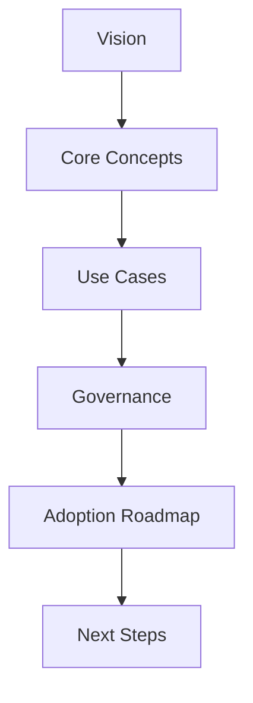

# Title & Objective

**Session Goal:** Enable Fiserv EMEA IT managers to understand AI Agents, MCP, and Agentic AI; identify 2–3 pilot opportunities; align on governance and KPIs.

## What to Say (Opening)
- “Today is about how AI becomes an enterprise lever at Fiserv—securely, compliantly, and measurably.”
- “We’ll keep it manager‑level; impact, workflows, and risk controls over code.”

## SME Knowledge (Know Cold)
- Fiserv EMEA portfolio focus: Payments, Risk & Compliance, Customer Channels, Insights/Optimization.
- **Current Technology Stack:** MCP built (awaiting higher env), actively developing **Google ADK** (Agent Development Kit), **A2A** (Agent-to-Agent protocol), and **AGUI** (Agent GUI framework); strong RAG experience.
- **Why This Matters:** We're building on Google's enterprise-grade ADK stack—the "Android for AI Agents"—which provides standardized agent orchestration, secure A2A communication, and enterprise-ready tooling.

## Mermaid – Session Map

## Audience Q&A
- **Q:** Is this a coding session?  
  **A:** No—manager-level strategy, workflows, risks, and pilots.
- **Q:** What do you need from us today?  
  **A:** Alignment on 1–2 pilot areas and sponsorship for governance review.
