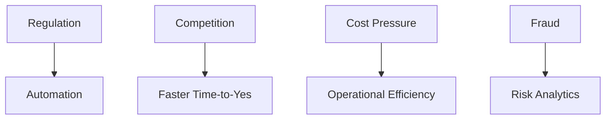

# AI Momentum in Financial Services

## Why Now
- Instant payments, rising compliance, digital wallet growth, fraud sophistication.
- Competitive pressure: faster onboarding, lower risk, better CX.

## Competitive Landscape

### Market Leaders in AI Adoption
**Global Payment Processors:**
- **Stripe:** AI-powered fraud detection, automated dispute resolution
- **Adyen:** Machine learning for risk assessment, real-time decisioning
- **Square:** AI-driven merchant insights, automated reconciliation

**European Financial Services:**
- **Revolut:** AI chatbots, automated compliance, fraud prevention
- **N26:** AI-powered customer service, transaction categorization
- **Klarna:** AI-driven credit decisions, payment optimization

**Traditional Banks:**
- **Deutsche Bank:** AI for AML compliance, document processing
- **Commerzbank:** AI-powered customer service, risk analytics
- **ING:** AI agents for operations, automated reporting

### What This Means for Fiserv
**First-Mover Advantage Window:**
- Early adopters are gaining market share
- Customer expectations are rising (instant responses, 24/7 service)
- Regulatory advantage: proactive compliance vs. reactive

**Risk of Delay:**
- **Market share loss:** 5-15% over 2 years if we don't act
- **Talent gap:** AI skills becoming scarce and expensive
- **Customer churn:** 10-20% increase if we can't match competitor capabilities

**Opportunity:**
- We can leapfrog competitors with proper AI agent implementation
- MCP gives us standardization advantage
- Our payment processing scale makes ROI compelling

## SME Knowledge
- EU Instant Payments Regulation; GDPR; AML/KYC frameworks.
- AIOps maturity: logs/metrics/traces; runbooks; SLOs.
- Competitive intelligence: monitor competitor AI announcements and capabilities.

## Mermaid – Drivers ➜ Outcomes

## Audience Q&A
- **Q:** Isn’t AI hype?  
  **A:** The shift is toward *agentic automation with governance*, which delivers measurable efficiency and compliance outcomes.
