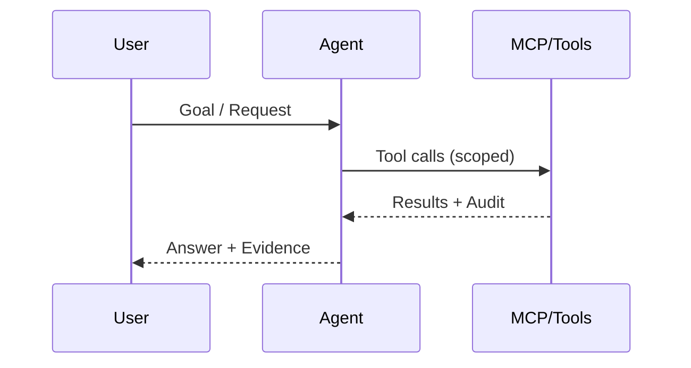

# What Are AI Agents

## Definition
Autonomous or semi‑autonomous software that perceives, reasons, and acts using enterprise tools.

## SME Knowledge
- Perception (inputs/logs/APIs) → Reasoning (policies/goals) → Action (tool/API calls via MCP).
- Single-agent vs multi-agent; where HITL gates are placed.

## Mermaid – Agent Loop

## Audience Q&A
- **Q:** Is this just a chatbot?  
  **A:** No—agents can plan, call tools, and take actions with audit trails.
