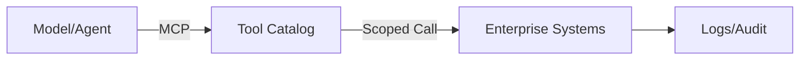

# Model Context Protocol (MCP)

## What It Is
A standard to connect models/agents to enterprise tools and data **securely and consistently**.

## Our Technology Stack

**Current Implementation:**
- **MCP:** Built and ready (awaiting higher environment deployment)
- **Google ADK:** Agent Development Kit—our core framework for building agents
- **A2A:** Agent-to-Agent protocol—enables secure agent collaboration
- **AGUI:** Agent GUI framework—user interface for agent interactions
- **RAG:** Strong experience with Retrieval-Augmented Generation

**How They Work Together:**
- **MCP** provides standardized tool access (APIs, databases, systems)
- **Google ADK** provides the agent runtime and orchestration framework
- **A2A** enables agents to communicate and collaborate securely
- **AGUI** provides the user interface layer for agent interactions
- **RAG** grounds agents in enterprise knowledge and context

**Why This Stack:**
- **Enterprise-Grade:** Google ADK provides production-ready agent patterns
- **Standardized:** Open standards (MCP, A2A) ensure interoperability
- **Secure:** Built-in security, audit, and governance capabilities
- **Scalable:** Designed for multi-agent systems and enterprise scale

## SME Knowledge
- Tool discovery, scoped invocation, auth tokens, streaming, observability.
- Benefits: portability, least-privilege access, auditability.
- **Google ADK:** Agent runtime, messaging bus, tool calling, memory, observability.
- **A2A Protocol:** Secure agent-to-agent communication, task delegation, multi-agent coordination.
- **AGUI:** User interface framework for agent interactions and monitoring.

## Mermaid – Secure Tool Mediation

## Audience Q&A
- **Q:** Why MCP over ad hoc APIs?  
  **A:** It standardizes access, improves security/audit, and avoids one-offs.
