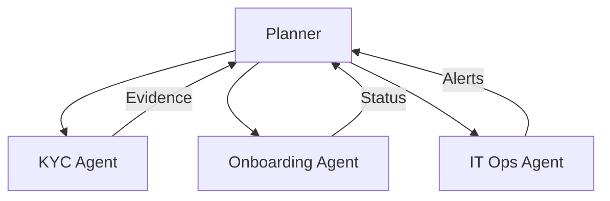

# Agentic AI

## Concept
Multiple specialized agents plan and collaborate under governance to complete workflows.

## Our Implementation Approach

**Technology Stack:**
- **Google ADK:** Provides the agent runtime and orchestration framework
- **A2A Protocol:** Enables secure agent-to-agent communication and task delegation
- **MCP:** Standardized tool access for agents
- **AGUI:** User interface for monitoring and controlling agent workflows
- **RAG:** Knowledge grounding for informed decision-making

**How It Works:**
- Agents built on **Google ADK** framework
- Agents communicate via **A2A** protocol (secure, auditable)
- Agents access tools via **MCP** (standardized, secure)
- Human oversight via **AGUI** (monitoring, HITL gates)
- Knowledge retrieval via **RAG** (grounded in enterprise data)

## SME Knowledge
- Planning, tool selection, delegation, retry/recovery; incident rails; HITL.
- **Technology:** Google ADK for agent runtime, A2A for agent communication, MCP for tool access, AGUI for user interface, RAG for knowledge grounding.

## Mermaid – Orchestrated Agents

## Audience Q&A
- **Q:** Where do we begin?  
  **A:** Single-agent pilot with clear KPIs, then graduate to orchestrated flows.
