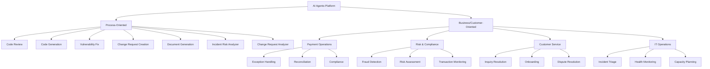

# AI Agents Use Cases for Fiserv EMEA

## Purpose
Concrete examples of how AI Agents, MCP, and Agentic AI deliver value across Process-Oriented (developer/IT operations) and Business/Customer-Oriented use cases.

## SME Knowledge
- Each use case maps to Fiserv EMEA portfolio areas.
- Risk levels: Low (read-only/suggestions), Medium (HITL gates), High (full automation with audit).
- Value drivers: time saved, accuracy improvement, compliance findings prevented, escalation reduction.

---

## Use Case Categories

### Category 1: Process-Oriented Use Cases
Developer and IT operations focused use cases that improve internal processes, code quality, and operational efficiency.

### Category 2: Business/Customer-Oriented Use Cases
Customer-facing and business-focused use cases that directly impact revenue, compliance, and customer experience.

---

## CATEGORY 1: PROCESS-ORIENTED USE CASES

### 1. Code Review Agent

**Problem:** Manual code reviews are time-consuming, inconsistent, and may miss security vulnerabilities or best practices.

**Solution:** AI Agent reviews code changes, checks for security issues, code quality, compliance with standards, and provides detailed feedback with recommendations.

**Agent Workflow:**
```
Code Change → Review Agent → Static Analysis →
Security Check → Code Quality Assessment →
Best Practices Check → Generate Review Report
```

**Tools (MCP):**
- Version control systems (Git, GitLab)
- Static analysis tools
- Security scanning APIs
- Code quality checkers
- Documentation systems

**Value:**
- 70-80% reduction in manual review time
- Consistent code quality standards
- Early detection of security vulnerabilities
- Automated compliance checking

**Risk Level:** Low (read-only, suggestions only)

**Fiserv Context:** Improves code quality, reduces security risks, accelerates development cycles.

---

### 2. Code Generation Agent

**Problem:** Developers spend significant time writing boilerplate code, implementing standard patterns, and creating repetitive functionality.

**Solution:** Agent generates code based on specifications, follows coding standards, implements patterns, and creates test cases.

**Agent Workflow:**
```
Specification → Generation Agent → Pattern Selection →
Code Generation → Test Case Creation →
Code Review → Deliver with Documentation
```

**Tools (MCP):**
- Code repositories
- Template libraries
- Testing frameworks
- Documentation systems
- Code review tools

**Value:**
- 50-60% reduction in development time for standard features
- Consistent code patterns across projects
- Automated test generation
- Reduced human error

**Risk Level:** Medium (HITL for production code, auto-approve for tests)

**Fiserv Context:** Accelerates development, ensures consistency, reduces technical debt.

---

### 3. Vulnerability Fix Agent

**Problem:** Security vulnerabilities require immediate attention, but manual fixing is slow and may introduce new issues.

**Solution:** Agent identifies vulnerabilities, analyzes impact, generates fix suggestions, tests fixes, and creates patches.

**Agent Workflow:**
```
Vulnerability Alert → Fix Agent → Impact Analysis →
Fix Generation → Test Fix → Create Patch →
Review & Deploy
```

**Tools (MCP):**
- Security scanning tools
- Vulnerability databases (CVE)
- Code repositories
- Testing frameworks
- Deployment systems

**Value:**
- 60-70% faster vulnerability remediation
- Consistent security fixes
- Reduced risk of introducing new vulnerabilities
- Automated testing of fixes

**Risk Level:** Medium (HITL for critical fixes, auto-approve for low-risk)

**Fiserv Context:** Critical for payment systems security, compliance with security standards.

---

### 4. Change Request Creation Agent

**Problem:** Creating change requests requires gathering context, documenting impact, and following processes—time-consuming and error-prone.

**Solution:** Agent analyzes change requirements, gathers system context, assesses impact, generates change request documentation, and routes for approval.

**Agent Workflow:**
```
Change Request → Agent → Context Gathering →
Impact Analysis → Risk Assessment →
Documentation Generation → Routing for Approval
```

**Tools (MCP):**
- Change management systems (ServiceNow, Jira)
- Configuration management databases (CMDB)
- System documentation
- Impact analysis tools
- Approval workflows

**Value:**
- 70% reduction in change request creation time
- Consistent documentation
- Better impact assessment
- Reduced errors in change requests

**Risk Level:** Low (read-only, generates documentation)

**Fiserv Context:** Streamlines IT change management, reduces errors, improves compliance.

---

### 5. Document Generation Agent

**Problem:** Technical documentation, API docs, and process documentation are often outdated, incomplete, or missing.

**Solution:** Agent generates documentation from code, specifications, and processes, keeps it up-to-date, and ensures consistency.

**Agent Workflow:**
```
Source (Code/Specs) → Doc Agent → Analysis →
Documentation Generation → Review →
Update Existing Docs → Publish
```

**Tools (MCP):**
- Code repositories
- Documentation systems (Confluence, Wiki)
- API documentation tools
- Process documentation systems
- Version control

**Value:**
- 80% reduction in documentation time
- Always up-to-date documentation
- Consistent format and style
- Improved knowledge sharing

**Risk Level:** Low (read-only, generates documentation)

**Fiserv Context:** Improves developer onboarding, reduces knowledge gaps, ensures compliance documentation.

---

### 6. Incident Risk Analyzer Agent

**Problem:** Assessing risk of IT incidents and changes requires analyzing multiple factors, historical data, and system dependencies.

**Solution:** Agent analyzes incident patterns, system dependencies, historical data, and provides risk scores with recommendations.

**Agent Workflow:**
```
Incident/Change → Risk Agent → Pattern Analysis →
Dependency Mapping → Historical Review →
Risk Score Calculation → Recommendations
```

**Tools (MCP):**
- Incident management systems
- Monitoring systems (logs/metrics)
- CMDB (system dependencies)
- Historical incident databases
- Risk assessment models

**Value:**
- 60% faster risk assessment
- More accurate risk scoring
- Proactive risk identification
- Better decision-making

**Risk Level:** Low (read-only, provides analysis)

**Fiserv Context:** Improves incident management, reduces risk of production issues, better change management.

---

### 7. Change Request Analyzer Agent

**Problem:** Analyzing change requests for risk, impact, and approval requires reviewing multiple systems, dependencies, and historical data.

**Solution:** Agent analyzes change requests, assesses impact, checks dependencies, reviews historical changes, and provides risk assessment with recommendations.

**Agent Workflow:**
```
Change Request → Analyzer Agent → Impact Analysis →
Dependency Check → Historical Review →
Risk Assessment → Approval Recommendation
```

**Tools (MCP):**
- Change management systems
- CMDB (dependencies)
- Historical change databases
- System monitoring
- Risk assessment models

**Value:**
- 70% faster change analysis
- Better impact assessment
- Reduced risk of failed changes
- Consistent approval criteria

**Risk Level:** Low (read-only, provides analysis)

**Fiserv Context:** Critical for IT change management, reduces production incidents, improves change success rate.

---

## CATEGORY 2: BUSINESS/CUSTOMER-ORIENTED USE CASES

### 1. Payment Processing & Operations

#### 1.1 Payment Exception Handling Agent
**Problem:** Manual review of failed/flagged transactions is time-consuming and error-prone.

**Solution:** AI Agent monitors payment exceptions, retrieves transaction context via MCP tools, and either auto-resolves (low-risk) or escalates with evidence (high-risk).

**Agent Workflow:**
```
Payment Exception → Agent retrieves transaction history → 
Checks business rules → Auto-resolve or escalate with evidence
```

**Tools (MCP):**
- Payment gateway APIs
- Customer database queries
- Business rule engine
- Audit logging

**ROI:**
- 60-70% reduction in manual review time
- Faster resolution (minutes vs hours)
- Consistent application of business rules

**Risk Level:** Medium (HITL for high-value transactions)

**Fiserv Context:** Applicable to Telecash payment processing, FirstData transaction monitoring.

---

#### 1.2 Instant Payment Compliance Agent
**Problem:** EU Instant Payments Regulation requires real-time compliance checks and reporting.

**Solution:** Agent monitors instant payment flows, performs compliance checks (AML, sanctions screening), and generates regulatory reports automatically.

**Agent Workflow:**
```
Instant Payment → Compliance Agent → 
Sanctions Check → AML Risk Score → 
Approve/Flag → Generate Compliance Report
```

**Tools (MCP):**
- Sanctions list APIs
- AML risk scoring engine
- Regulatory reporting database
- Audit trail system

**ROI:**
- 100% compliance coverage (no missed checks)
- Real-time processing vs batch delays
- Automated report generation saves 20+ hours/week

**Risk Level:** High (full automation with comprehensive audit trail)

**Fiserv Context:** Critical for EU Instant Payments Regulation compliance.

---

#### 1.3 Payment Reconciliation Agent
**Problem:** Daily reconciliation between payment systems, banks, and ledgers requires manual effort and is prone to discrepancies.

**Solution:** Agent performs automated reconciliation, identifies discrepancies, and either auto-matches or flags for review with detailed evidence.

**Agent Workflow:**
```
Daily Reconciliation Trigger → Agent fetches data from multiple sources →
Match transactions → Identify discrepancies →
Auto-resolve or flag with evidence
```

**Tools (MCP):**
- Payment system APIs
- Bank statement parsers
- General ledger queries
- Reconciliation database

**ROI:**
- 80% reduction in reconciliation time
- Early detection of discrepancies
- Improved accuracy (fewer false positives)

**Risk Level:** Medium (HITL for large discrepancies)

**Fiserv Context:** Applicable across all payment processing operations.

---

### 2. Risk Management & Fraud Prevention

#### 2.1 Real-Time Fraud Detection Agent
**Problem:** Fraud patterns evolve rapidly; rule-based systems miss new attack vectors.

**Solution:** Agent analyzes transaction patterns in real-time, uses ML models to detect anomalies, and takes action (block, flag, or allow) based on risk score.

**Agent Workflow:**
```
Transaction → Fraud Agent → Pattern Analysis →
Risk Score Calculation → Decision (Block/Flag/Allow) →
Alert if high risk
```

**Tools (MCP):**
- Transaction monitoring APIs
- ML model endpoints
- Customer behavior database
- Fraud case management system

**ROI:**
- 30-40% reduction in false positives
- Faster fraud detection (seconds vs minutes)
- Adaptive to new fraud patterns

**Risk Level:** High (automated with HITL for edge cases)

**Fiserv Context:** Critical for payment security and customer trust.

---

#### 2.2 Credit Risk Assessment Agent
**Problem:** Credit decisions require analysis of multiple data sources; manual review is slow and inconsistent.

**Solution:** Agent aggregates data from credit bureaus, internal systems, and alternative sources, calculates risk scores, and provides recommendations with explainability.

**Agent Workflow:**
```
Credit Application → Risk Agent → Data Aggregation →
Risk Score Calculation → Recommendation (Approve/Reject/Review) →
Explainability Report
```

**Tools (MCP):**
- Credit bureau APIs
- Internal customer data
- Alternative data sources
- Risk model endpoints

**ROI:**
- 50% faster credit decisions
- More consistent risk assessment
- Better explainability for regulatory compliance

**Risk Level:** Medium (HITL for borderline cases)

**Fiserv Context:** Applicable to merchant onboarding and credit products.

---

#### 2.3 Transaction Monitoring & Alerting Agent
**Problem:** Monitoring millions of transactions for suspicious activity requires constant attention and generates alert fatigue.

**Solution:** Agent continuously monitors transactions, applies intelligent filtering, and only escalates high-priority alerts with context.

**Agent Workflow:**
```
Transaction Stream → Monitoring Agent → Pattern Detection →
Alert Prioritization → High-Priority Alert with Context →
Low-Priority → Batch Report
```

**Tools (MCP):**
- Real-time transaction feed
- Alert management system
- Historical pattern database
- Compliance reporting tools

**ROI:**
- 70% reduction in alert fatigue
- Faster response to critical alerts
- Better resource allocation

**Risk Level:** Medium (read-only with escalation)

**Fiserv Context:** Essential for AML/CTF compliance.

---

### 3. Compliance & Regulatory Reporting

#### 3.1 AML/KYC Document Processing Agent
**Problem:** Manual review of KYC documents is time-consuming and inconsistent; regulatory requirements are complex.

**Solution:** Agent extracts data from KYC documents, validates against regulatory requirements, performs identity verification, and flags exceptions for review.

**Agent Workflow:**
```
KYC Document Upload → Document Agent → OCR & Extraction →
Data Validation → Identity Verification → 
Compliance Check → Approve/Flag for Review
```

**Tools (MCP):**
- Document processing APIs
- OCR services
- Identity verification services
- Regulatory rule engine

**ROI:**
- 60% reduction in processing time
- Consistent application of rules
- Better compliance coverage

**Risk Level:** Medium (HITL for exceptions)

**Fiserv Context:** Critical for customer onboarding compliance.

---

#### 3.2 Regulatory Reporting Agent
**Problem:** Generating regulatory reports (e.g., BaFin, ECB) requires data aggregation from multiple systems and manual formatting.

**Solution:** Agent aggregates data from required sources, formats according to regulatory templates, validates completeness, and generates reports automatically.

**Agent Workflow:**
```
Reporting Schedule → Reporting Agent → Data Aggregation →
Template Formatting → Validation → 
Generate Report → Submit/Notify
```

**Tools (MCP):**
- Data warehouse queries
- Regulatory template library
- Report generation engine
- Submission APIs

**ROI:**
- 80% time savings on report generation
- Reduced errors (automated validation)
- On-time submission guarantee

**Risk Level:** High (automated with approval workflow)

**Fiserv Context:** Essential for German/EU regulatory compliance (BaFin, ECB).

---

#### 3.3 GDPR Data Subject Request Agent
**Problem:** Handling GDPR data subject requests (access, deletion, portability) requires manual data discovery and manual processing.

**Solution:** Agent receives data subject requests, discovers all relevant data across systems, compiles responses, and executes deletions/portability with audit trails.

**Agent Workflow:**
```
GDPR Request → Agent → Data Discovery →
Data Compilation → Privacy Review →
Execute Request → Audit Log
```

**Tools (MCP):**
- Customer data APIs
- Data catalog
- Privacy management system
- Audit logging

**ROI:**
- 90% reduction in processing time
- Complete data discovery (no missed systems)
- Full audit trail for compliance

**Risk Level:** High (automated with privacy review gate)

**Fiserv Context:** Critical for GDPR compliance in Germany/EU.

---

### 4. Customer Service & Support

#### 4.1 Customer Inquiry Resolution Agent
**Problem:** Customer service teams handle repetitive inquiries; response times vary; knowledge is fragmented.

**Solution:** Agent retrieves customer context, searches knowledge base, provides answers with citations, and escalates complex cases to human agents with full context.

**Agent Workflow:**
```
Customer Inquiry → Agent → Context Retrieval →
Knowledge Base Search → Answer Generation →
Provide Answer or Escalate with Context
```

**Tools (MCP):**
- Customer database
- Knowledge base (RAG)
- Ticket management system
- Communication channels

**ROI:**
- 50-60% reduction in ticket volume
- Faster response times (seconds vs minutes)
- Consistent, accurate answers

**Risk Level:** Low (read-only with escalation)

**Fiserv Context:** Improves customer satisfaction and reduces support costs.

---

#### 4.2 Account Onboarding Agent
**Problem:** Merchant/account onboarding involves multiple steps, document collection, and verification; process is slow and error-prone.

**Solution:** Agent orchestrates onboarding workflow, collects required documents, performs validations, coordinates with internal systems, and tracks progress.

**Agent Workflow:**
```
Onboarding Request → Agent → Document Collection →
Validation → System Integration → 
Progress Tracking → Completion/Exception
```

**Tools (MCP):**
- Document management
- Identity verification
- CRM systems
- Payment gateway APIs

**ROI:**
- 40% faster onboarding
- Reduced errors (automated validation)
- Better customer experience

**Risk Level:** Medium (HITL for approvals)

**Fiserv Context:** Critical for merchant acquisition and growth.

---

#### 4.3 Dispute Resolution Agent
**Problem:** Payment disputes require investigation, evidence gathering, and decision-making; process is manual and time-consuming.

**Solution:** Agent investigates disputes, gathers transaction evidence, applies business rules, and either auto-resolves or escalates with recommendations.

**Agent Workflow:**
```
Dispute Filed → Agent → Evidence Gathering →
Rule Application → Decision Logic →
Auto-Resolve or Escalate with Recommendation
```

**Tools (MCP):**
- Transaction history
- Customer communication logs
- Business rule engine
- Dispute management system

**ROI:**
- 50% faster dispute resolution
- Consistent application of rules
- Better customer satisfaction

**Risk Level:** Medium (HITL for high-value disputes)

**Fiserv Context:** Reduces operational costs and improves customer experience.

---

### 5. IT Operations & AIOps

#### 5.1 Incident Triage & Resolution Agent
**Problem:** IT incidents flood operations teams; many are false positives or can be auto-resolved; critical incidents need fast response.

**Solution:** Agent monitors alerts, triages incidents, applies runbooks for known issues, and escalates unknowns with full context.

**Agent Workflow:**
```
Alert → Triage Agent → Classification →
Known Issue → Runbook Execution →
Unknown → Escalate with Context
```

**Tools (MCP):**
- Monitoring systems (logs/metrics/traces)
- Runbook database
- Incident management system
- Configuration management

**ROI:**
- 70% reduction in false positives
- Faster resolution (auto-remediation)
- Better focus on critical incidents

**Risk Level:** Medium (read-only/suggestions initially, then safe automations)

**Fiserv Context:** Improves IT operations efficiency and reduces MTTR.

---

#### 5.2 System Health Monitoring Agent
**Problem:** Proactive system monitoring requires constant attention; early warning signs are missed.

**Solution:** Agent continuously monitors system health metrics, detects anomalies, predicts potential issues, and takes preventive actions.

**Agent Workflow:**
```
Metrics Stream → Monitoring Agent → Anomaly Detection →
Trend Analysis → Predictive Alerts →
Preventive Actions or Escalation
```

**Tools (MCP):**
- Metrics/APM systems
- Anomaly detection models
- Alerting systems
- Automation runbooks

**ROI:**
- Proactive issue prevention
- Reduced downtime
- Better resource utilization

**Risk Level:** Low (read-only with alerts)

**Fiserv Context:** Critical for payment system reliability.

---

#### 5.3 Capacity Planning Agent
**Problem:** Capacity planning requires analysis of historical data, trend forecasting, and resource allocation decisions.

**Solution:** Agent analyzes usage patterns, forecasts demand, recommends capacity changes, and tracks resource utilization.

**Agent Workflow:**
```
Usage Data → Planning Agent → Trend Analysis →
Demand Forecasting → Recommendations →
Resource Allocation Tracking
```

**Tools (MCP):**
- Usage metrics
- Historical data
- Forecasting models
- Resource management APIs

**ROI:**
- Optimized resource allocation
- Cost savings (right-sizing)
- Proactive scaling

**Risk Level:** Low (recommendations only)

**Fiserv Context:** Helps optimize infrastructure costs.

---

### 6. Business Intelligence & Analytics

#### 6.1 Executive Reporting Agent
**Problem:** Generating executive reports requires data aggregation from multiple sources and manual formatting.

**Solution:** Agent aggregates data from business systems, generates insights, creates formatted reports, and delivers on schedule.

**Agent Workflow:**
```
Reporting Schedule → Agent → Data Aggregation →
Insight Generation → Report Formatting →
Delivery (Email/Dashboard)
```

**Tools (MCP):**
- Data warehouse
- Business intelligence tools
- Report templates
- Delivery channels

**ROI:**
- Time savings (hours to minutes)
- Consistent, accurate reports
- Timely delivery

**Risk Level:** Low (read-only)

**Fiserv Context:** Enables data-driven decision making.

---

#### 6.2 Anomaly Detection & Investigation Agent
**Problem:** Business anomalies (revenue drops, unusual patterns) are detected late; investigation is manual.

**Solution:** Agent monitors business metrics, detects anomalies, investigates root causes, and provides insights with recommendations.

**Agent Workflow:**
```
Metrics → Agent → Anomaly Detection →
Root Cause Analysis → Insight Generation →
Recommendations Report
```

**Tools (MCP):**
- Business metrics APIs
- Data analysis tools
- Investigation databases
- Reporting systems

**ROI:**
- Early anomaly detection
- Faster root cause analysis
- Proactive issue resolution

**Risk Level:** Low (read-only with insights)

**Fiserv Context:** Helps identify business opportunities and risks.

---

## Use Case Selection Matrix

### Process-Oriented Use Cases

| Use Case | Business Impact | Technical Feasibility | Risk Level | Pilot Priority |
|----------|----------------|----------------------|------------|----------------|
| Code Review | High | High | Low | ⭐⭐⭐ |
| Code Generation | High | High | Medium | ⭐⭐⭐ |
| Vulnerability Fix | High | High | Medium | ⭐⭐⭐ |
| Change Request Creation | Medium | High | Low | ⭐⭐ |
| Document Generation | Medium | High | Low | ⭐⭐ |
| Incident Risk Analyzer | High | High | Low | ⭐⭐⭐ |
| Change Request Analyzer | High | High | Low | ⭐⭐⭐ |

### Business/Customer-Oriented Use Cases

| Use Case | Business Impact | Technical Feasibility | Risk Level | Pilot Priority |
|----------|----------------|----------------------|------------|----------------|
| Payment Exception Handling | High | High | Medium | ⭐⭐⭐ |
| Instant Payment Compliance | High | High | High | ⭐⭐⭐ |
| Payment Reconciliation | Medium | High | Medium | ⭐⭐ |
| Real-Time Fraud Detection | High | Medium | High | ⭐⭐⭐ |
| Credit Risk Assessment | Medium | Medium | Medium | ⭐⭐ |
| Transaction Monitoring | High | High | Medium | ⭐⭐⭐ |
| AML/KYC Document Processing | High | High | Medium | ⭐⭐⭐ |
| Regulatory Reporting | High | High | High | ⭐⭐⭐ |
| GDPR Data Subject Requests | Medium | Medium | High | ⭐⭐ |
| Customer Inquiry Resolution | Medium | High | Low | ⭐⭐ |
| Account Onboarding | High | High | Medium | ⭐⭐⭐ |
| Dispute Resolution | Medium | Medium | Medium | ⭐⭐ |
| Incident Triage | Medium | High | Medium | ⭐⭐ |
| System Health Monitoring | High | High | Low | ⭐⭐ |
| Capacity Planning | Low | High | Low | ⭐ |
| Executive Reporting | Low | High | Low | ⭐ |
| Anomaly Detection | Medium | Medium | Low | ⭐⭐ |

**Priority Legend:**
- ⭐⭐⭐ = High priority for pilot
- ⭐⭐ = Medium priority
- ⭐ = Lower priority (can be addressed later)

---

## Implementation Roadmap

### Phase 1: Quick Wins (30-60 days)
**Process-Oriented:**
1. **Code Review Agent** (Low risk, high developer value)
2. **Document Generation Agent** (Low risk, immediate value)
3. **Change Request Analyzer** (Low risk, improves IT operations)

**Business-Oriented:**
4. **Customer Inquiry Resolution Agent** (Low risk, high visibility)
5. **Payment Exception Handling Agent** (Medium risk, high impact)

### Phase 2: Compliance & Risk (60-90 days)
**Process-Oriented:**
1. **Vulnerability Fix Agent** (Medium risk, critical for security)
2. **Code Generation Agent** (Medium risk, accelerates development)
3. **Incident Risk Analyzer** (Low risk, improves operations)

**Business-Oriented:**
4. **AML/KYC Document Processing Agent** (Medium risk, regulatory value)
5. **Transaction Monitoring Agent** (Medium risk, compliance critical)
6. **Regulatory Reporting Agent** (High risk, high value)

### Phase 3: Advanced Automation (90-120 days)
**Process-Oriented:**
1. **Change Request Creation Agent** (Low risk, streamlines IT)

**Business-Oriented:**
2. **Instant Payment Compliance Agent** (High risk, strategic)
3. **Real-Time Fraud Detection Agent** (High risk, competitive advantage)
4. **Account Onboarding Agent** (Medium risk, growth enabler)

---

## Key Success Factors

1. **Clear KPIs:** Define measurable outcomes (time saved, accuracy, compliance rate)
2. **HITL Gates:** Start with human oversight, gradually automate low-risk paths
3. **Audit Trails:** Every agent action must be logged and explainable
4. **Incremental Rollout:** Pilot with limited scope, measure, then scale
5. **Governance:** Regular reviews with Compliance, Risk, and IT teams
6. **Security First:** Implement zero-trust architecture, sandboxing, and threat detection from day one
7. **Continuous Monitoring:** Deploy behavioral analysis and threat detection for all agent operations

---

## Audience Q&A

**Q:** Which use case should we start with?  
**A:** For process-oriented: Start with **Code Review** or **Document Generation**—low risk, high developer value. For business-oriented: Start with **Customer Inquiry Resolution** or **Payment Exception Handling**—low to medium risk, clear value, and builds confidence.

**Q:** How do we measure success?  
**A:** Track time saved, accuracy improvement, compliance findings prevented, and escalation reduction. Set baseline metrics before pilot.

**Q:** What if an agent makes a mistake?  
**A:** HITL gates catch high-risk decisions. Audit trails enable root cause analysis. Start with read-only/suggestions, then automate safe paths.

**Q:** How long until we see value?  
**A:** 30-60 days for scoped pilots with clear KPIs and available data.

---

## Mermaid – Use Case Ecosystem



---

✅ **Next Steps:** Select 1-2 use cases for pilot, define KPIs, secure sponsorship, and schedule governance review.

