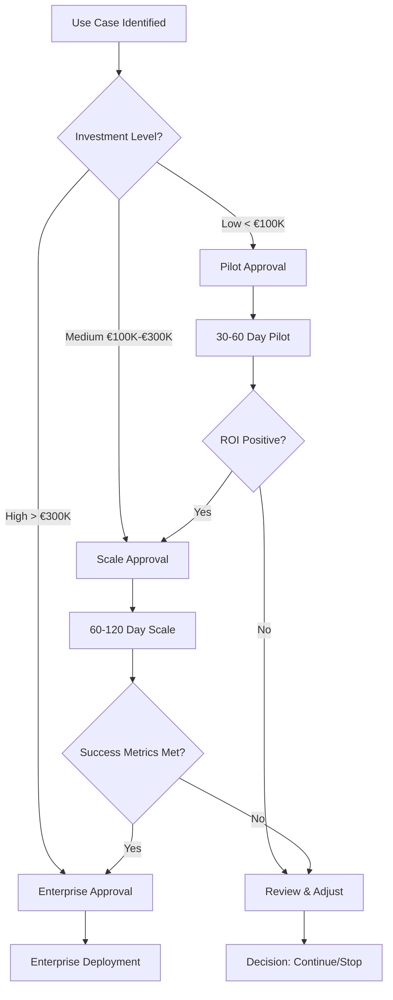

# Investment & ROI Framework

## Why This Matters
Managers need clarity on costs, returns, and the cost of delay. This framework provides transparent investment guidance for AI Agent adoption.

## Investment Categories

### 1. Infrastructure & Platform Costs
**Initial Setup (One-time):**
- AI platform licenses (model access, API costs)
- MCP infrastructure setup
- Sandboxing and security infrastructure
- Development and testing environments

**Ongoing Operations:**
- Model API usage (per-request or subscription)
- Infrastructure hosting (cloud/on-premise)
- Monitoring and logging tools
- Security tools and services

**Estimated Range:**
- **Low-risk pilot:** €15,000 - €30,000 (initial) + €5,000 - €10,000/month
- **Medium-scale deployment:** €50,000 - €100,000 (initial) + €20,000 - €40,000/month
- **Enterprise-wide:** €200,000+ (initial) + €80,000+/month

### 2. People & Skills
**Required Roles:**
- AI/ML engineers (development)
- Security specialists (governance)
- Compliance officers (regulatory alignment)
- Change management (organizational adoption)

**Estimated Costs:**
- **Pilot phase:** 1-2 FTE for 3-6 months
- **Scale phase:** 3-5 FTE ongoing
- **Training:** €5,000 - €15,000 per team

### 3. Governance & Compliance
**Initial Setup:**
- Governance framework development
- Compliance assessment (EU AI Act, GDPR, BaFin)
- Security controls implementation
- Audit and monitoring setup

**Ongoing:**
- Compliance reviews and audits
- Security monitoring and updates
- Governance committee operations

**Estimated Costs:**
- **Initial:** €30,000 - €60,000
- **Ongoing:** €10,000 - €20,000/month

---

## ROI Timeline & Metrics

### Phase 1: Pilot (30-60 days)
**Investment:** €50,000 - €100,000 total
**Expected Returns:**
- **Time savings:** 40-60% reduction in manual processing time
- **Accuracy improvement:** 20-30% reduction in errors
- **Cost avoidance:** Early detection of compliance issues, fraud prevention

**Success Criteria:**
- Positive ROI within 60 days
- Clear path to scale
- Governance framework validated

### Phase 2: Scale (60-120 days)
**Investment:** €150,000 - €300,000 total
**Expected Returns:**
- **Operational efficiency:** 50-70% reduction in manual work
- **Cost reduction:** €100,000 - €500,000/year in operational savings
- **Revenue impact:** Faster customer onboarding, reduced churn

**Success Criteria:**
- Break-even within 6 months
- Measurable business impact
- Regulatory compliance maintained

### Phase 3: Enterprise (120+ days)
**Investment:** €500,000+ total
**Expected Returns:**
- **Strategic advantage:** Competitive differentiation
- **Scalability:** Handle 10x transaction volume with same resources
- **Risk reduction:** Proactive compliance, fraud prevention

**Success Criteria:**
- Sustained ROI > 200%
- Business-critical operations automated
- Industry leadership position

---

## Cost of Delay

### Competitive Risk
**What Happens If We Wait:**
- Competitors gain first-mover advantage
- Market share erosion in digital payments
- Talent acquisition challenges (AI skills in high demand)
- Customer expectations exceed our capabilities

**Estimated Impact:**
- **Revenue at risk:** 5-15% market share loss over 2 years
- **Customer churn:** 10-20% increase in churn rate
- **Talent cost:** 30-50% premium to acquire AI talent later

### Regulatory Risk
**What Happens If We Wait:**
- EU AI Act compliance becomes mandatory (2026)
- GDPR Article 22 requirements for automated decision-making
- BaFin expectations for AI in financial services
- Potential fines: Up to 4% of annual revenue for non-compliance

**Estimated Impact:**
- **Compliance fines:** €1M - €10M+ potential exposure
- **Reputational damage:** Customer trust erosion
- **Operational disruption:** Forced compliance implementation

### Operational Risk
**What Happens If We Wait:**
- Manual processes become unsustainable at scale
- Error rates increase with volume
- Customer service quality degrades
- Fraud and security risks increase

**Estimated Impact:**
- **Operational costs:** 20-30% increase in manual processing costs
- **Error costs:** €500K - €2M/year in error-related losses
- **Security incidents:** €1M - €5M+ potential breach costs

---

## ROI Calculation Framework

### Formula
```
ROI = (Benefits - Costs) / Costs × 100%

Benefits = Time Savings + Error Reduction + Cost Avoidance + Revenue Impact
Costs = Infrastructure + People + Governance + Opportunity Cost
```

### Example: Payment Exception Handling Agent

**Investment (Year 1):**
- Infrastructure: €40,000
- People: €80,000
- Governance: €30,000
- **Total:** €150,000

**Benefits (Year 1):**
- Time savings (60% reduction): €120,000
- Error reduction: €40,000
- Compliance cost avoidance: €30,000
- Customer satisfaction improvement: €20,000
- **Total:** €210,000

**ROI:** (€210,000 - €150,000) / €150,000 × 100% = **40% Year 1**

**Payback Period:** 8.5 months

---

## Risk-Adjusted ROI

### Conservative Scenario (50% probability)
- Lower adoption rates
- Higher implementation costs
- Delayed benefits
- **ROI:** 15-25%

### Base Case Scenario (30% probability)
- Expected adoption and costs
- On-time benefits
- **ROI:** 40-60%

### Optimistic Scenario (20% probability)
- High adoption rates
- Lower costs than expected
- Faster benefits realization
- **ROI:** 80-120%

---

## Budget Approval Framework

### Pilot Approval (Low Risk)
**Ask:** €50,000 - €100,000
**Timeline:** 30-60 days
**Decision Criteria:**
- Clear use case with measurable KPIs
- Low-risk application (read-only or low-value transactions)
- Governance framework in place
- Success metrics defined

### Scale Approval (Medium Risk)
**Ask:** €150,000 - €300,000
**Timeline:** 60-120 days
**Decision Criteria:**
- Pilot success demonstrated (positive ROI)
- Governance validated
- Security controls proven
- Business case validated

### Enterprise Approval (Higher Risk)
**Ask:** €500,000+
**Timeline:** 120+ days
**Decision Criteria:**
- Multiple successful pilots
- Enterprise governance framework
- Security and compliance validated
- Strategic business case

---

## Mermaid – Investment Decision Flow



---

## SME Knowledge
- Understand Fiserv EMEA budget approval processes
- Know typical IT project ROI expectations (20-40% is good)
- Be prepared to justify costs against alternatives (status quo, vendor solutions)
- Have backup scenarios if budget is reduced

## Audience Q&A

**Q: How do we justify this investment?**  
**A:** Start with low-risk pilots (€50K-€100K) that demonstrate clear ROI within 60 days. Use success to justify scale investments.

**Q: What if ROI is lower than expected?**  
**A:** We have conservative, base, and optimistic scenarios. Even conservative scenario shows positive ROI. Risk is mitigated by starting small.

**Q: Can we reduce costs?**  
**A:** Yes—start with read-only use cases, use existing infrastructure where possible, and phase governance implementation.

**Q: What's the cost of NOT doing this?**  
**A:** Competitive disadvantage, regulatory risk (€1M-€10M+ fines), operational inefficiency, and customer churn. The cost of delay exceeds the cost of action.

**Q: How do we measure ROI?**  
**A:** Track time saved, error reduction, cost avoidance, and revenue impact. Compare against baseline metrics from before AI implementation.

