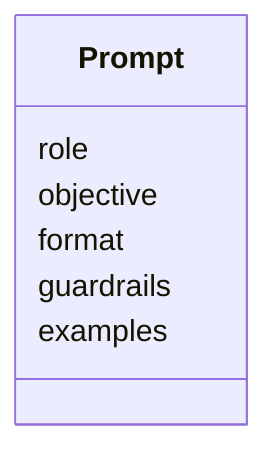

# Prompt Engineering

## Manager View
Prompts = policy-driven instructions that steer outcomes.

## SME Knowledge
- Role+Objective; Format-first (JSON/YAML); guardrails (cite sources; escalate); few‑shot.
- Treat prompts like product requirements: version, lint, A/B test.

## Mermaid – Prompt Structure

## Audience Q&A
- **Q:** How do we keep outputs consistent?  
  **A:** Versioned prompt templates + compliance linting + sample-based tests.
