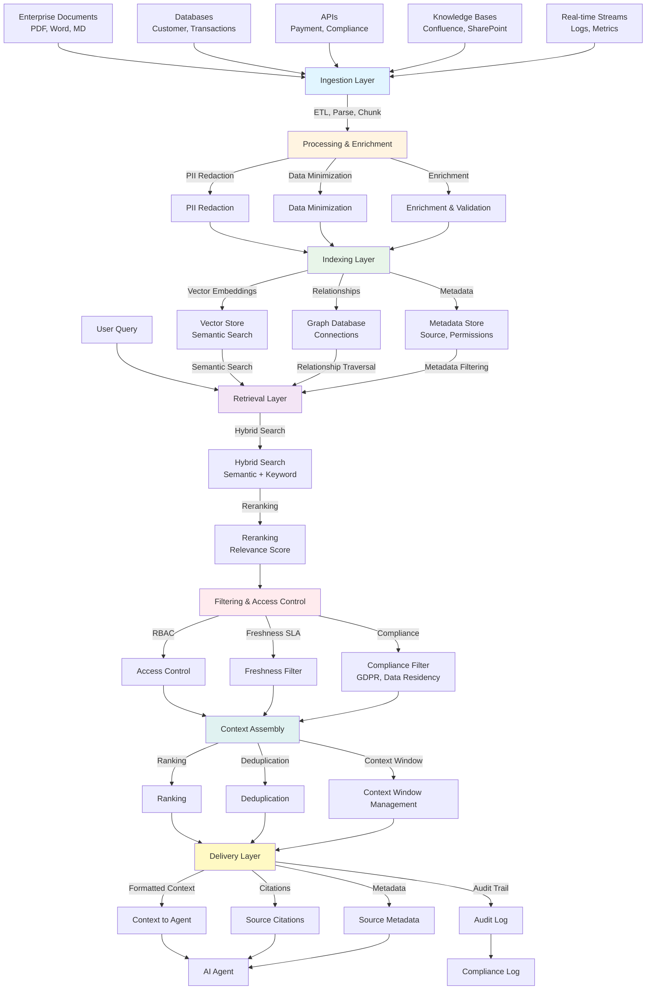

# Context Engineering

## Purpose
Ground the model in trusted enterprise data at inference time. Context Engineering ensures AI agents have access to accurate, relevant, and compliant enterprise knowledge.

## Core Components

### 1. Data Sources Layer
**Enterprise Data Sources:**
- Documents (PDFs, Word, Markdown)
- Databases (customer data, transaction records)
- APIs (payment systems, compliance systems)
- Knowledge bases (Confluence, SharePoint)
- Real-time data streams (logs, metrics)

### 2. Ingestion Layer
**Data Processing:**
- **ETL (Extract, Transform, Load):** Pull data from sources
- **Parsing:** Extract text, structure, metadata
- **Chunking:** Break documents into manageable pieces
- **Metadata Extraction:** Capture source, date, author, permissions

### 3. Processing & Enrichment Layer
**Data Quality & Compliance:**
- **PII Redaction:** Remove sensitive information (SSN, credit cards, names)
- **Data Minimization:** Only keep necessary information
- **Enrichment:** Add tags, categories, relationships
- **Validation:** Ensure data quality and completeness

### 4. Indexing Layer
**Knowledge Storage:**
- **Vector Store:** Semantic embeddings for similarity search
- **Graph Database:** Relationships and connections
- **Metadata Store:** Source information, permissions, freshness
- **Hybrid Index:** Combines vector and keyword search

### 5. Retrieval Layer
**Context Retrieval:**
- **Semantic Search:** Find similar content using embeddings
- **Keyword Search:** Traditional text matching
- **Hybrid Search:** Combines semantic + keyword for best results
- **Reranking:** Prioritize most relevant results

### 6. Filtering & Access Control Layer
**Policy Enforcement:**
- **Access Control:** Role-based permissions (RBAC)
- **Data Filtering:** Remove unauthorized content
- **Freshness Filtering:** Only use data within SLA (e.g., last 30 days)
- **Compliance Filtering:** GDPR, data residency requirements

### 7. Context Assembly Layer
**Context Preparation:**
- **Ranking:** Order results by relevance
- **Deduplication:** Remove duplicate information
- **Context Window Management:** Fit within LLM limits
- **Citation Generation:** Link back to source documents

### 8. Delivery Layer
**Context to Agent:**
- **Formatted Context:** Structured for LLM consumption
- **Citations:** Source references for every claim
- **Metadata:** Source, date, confidence scores
- **Audit Trail:** Complete log of what was retrieved and why

## Mermaid – Context Engineering Architecture

## Why This Architecture Matters

**For Managers:**
- **Quality:** Ensures agents use accurate, up-to-date enterprise data
- **Compliance:** Built-in PII redaction, access control, audit trails
- **Security:** Role-based access, data filtering, compliance checks
- **Efficiency:** Hybrid search finds relevant information quickly
- **Transparency:** Citations show where information came from

**For Operations:**
- **Scalable:** Handles large volumes of enterprise data
- **Maintainable:** Clear separation of concerns
- **Observable:** Complete audit trail for compliance
- **Flexible:** Supports multiple data sources and formats

## SME Knowledge
- **Pipeline:** Ingest → Process → Index → Retrieve → Filter → Assemble → Deliver
- **Key Technologies:** Vector stores (Weaviate, Pinecone), Graph DBs (Neo4j), Embeddings (OpenAI, Cohere)
- **Compliance:** PII redaction, data minimization, freshness SLAs, GDPR compliance
- **Performance:** Hybrid search, reranking, context window optimization
- **Governance:** Access control, audit trails, citation tracking

## Audience Q&A
- **Q:** Does this prevent hallucinations?  
  **A:** Yes—by grounding agents in authoritative enterprise data with citations, we significantly reduce hallucinations. Agents can only use information from approved sources.

- **Q:** How do we ensure data freshness?  
  **A:** Freshness SLAs define how old data can be (e.g., 30 days). The filtering layer automatically excludes stale data, and we can set up automated refresh pipelines.

- **Q:** What about sensitive data?  
  **A:** PII redaction removes sensitive information during processing. Access control ensures only authorized users see relevant data. All access is logged for compliance.

- **Q:** How does this integrate with our existing systems?  
  **A:** The ingestion layer connects to existing databases, APIs, and knowledge bases. We use standard protocols (REST APIs, database connectors) to pull data without disrupting current systems.
