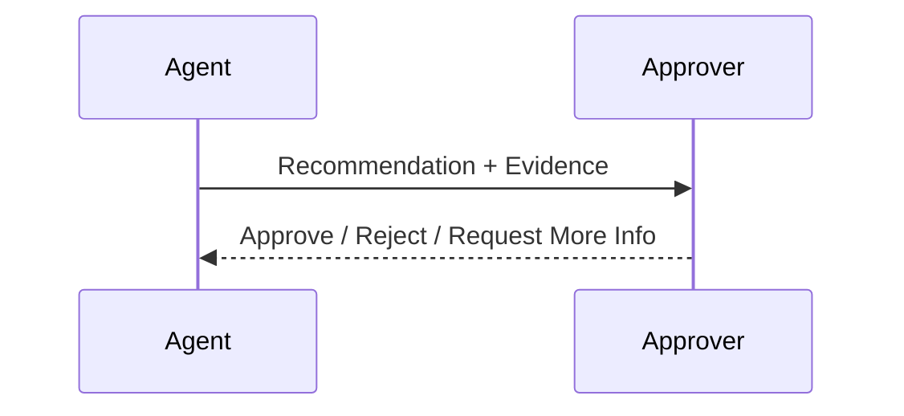

# Human-in-the-Loop (HITL)

## Role
Humans supervise and approve critical decisions.

## SME Knowledge
- Decision points: risk thresholds, uncertainty, regulatory triggers; reviewer UX.

## Mermaid – HITL Gate

## Audience Q&A
- **Q:** Will HITL slow us down?  
  **A:** Only applied to high‑risk actions; low‑risk flows remain automated.
