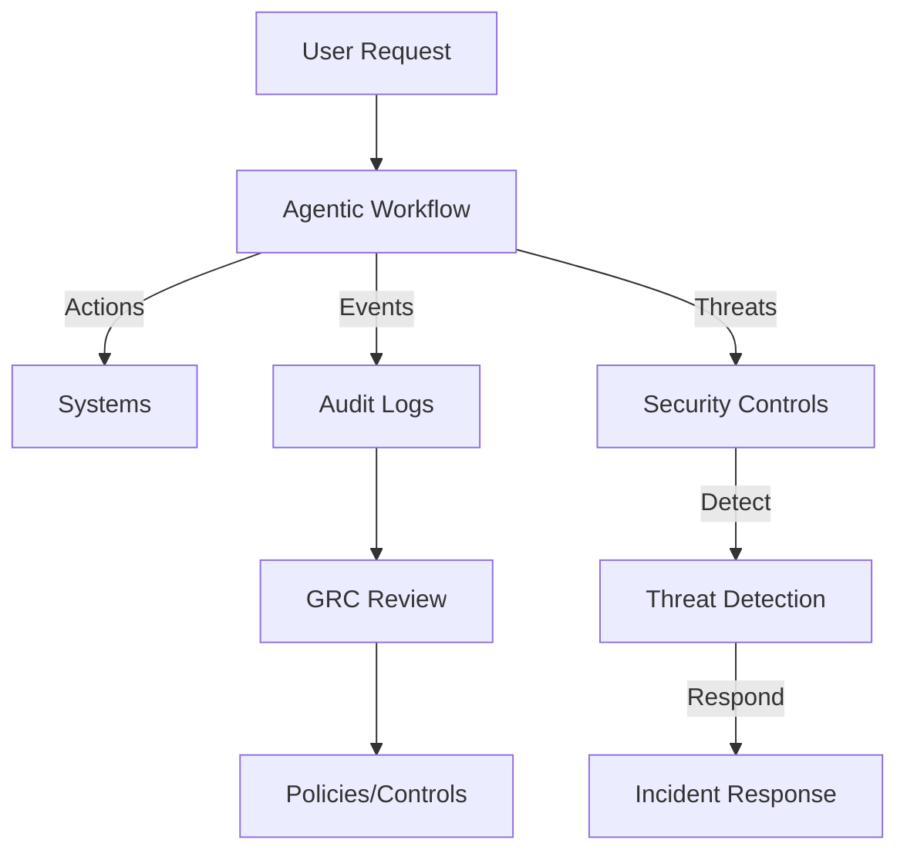

# Governance & Compliance

## Why It Matters
Regulated environment demands explainability, auditability, and data protection. **Critical:** AI can be weaponized—we must govern proactively. German financial services face strict regulatory requirements that must be addressed from day one.

## Regulatory Requirements (Germany/EU)

### EU AI Act (Effective 2026)
**Risk Classification:**
- **Prohibited AI:** Social scoring, manipulative AI (not applicable to our use cases)
- **High-Risk AI:** AI used in financial services, credit scoring, biometric identification
- **Limited-Risk AI:** Chatbots, customer service agents (transparency requirements)
- **Minimal-Risk AI:** Most of our use cases fall here, but must document

**Our Classification:**
- **Payment Exception Handling:** Limited-Risk (transparency required)
- **Fraud Detection:** High-Risk (requires conformity assessment)
- **Credit Risk Assessment:** High-Risk (requires conformity assessment)
- **Customer Service Agents:** Limited-Risk (transparency required)

**Compliance Requirements:**
- **Risk Management System:** Document risks, mitigation, monitoring
- **Data Governance:** Training data quality, data management
- **Technical Documentation:** System architecture, algorithms, data flows
- **Record Keeping:** Log all AI decisions, maintain audit trails
- **Transparency:** Inform users when interacting with AI
- **Human Oversight:** HITL gates for high-risk decisions
- **Accuracy & Robustness:** Testing, validation, monitoring

**Penalties for Non-Compliance:**
- Up to €35M or 7% of annual revenue (whichever is higher)
- For prohibited AI violations: up to €15M or 3% of annual revenue

### GDPR (General Data Protection Regulation)

**Article 22 - Automated Decision-Making:**
- **Right to Human Review:** Users have right to contest automated decisions
- **Transparency:** Must explain how automated decisions are made
- **Data Subject Rights:** Right to access, rectification, erasure
- **Our Impact:** AI agents making credit, fraud, or payment decisions must allow human review

**Article 25 - Data Protection by Design:**
- **Privacy by Design:** Build privacy into AI systems from start
- **Data Minimization:** Only collect/process necessary data
- **Our Implementation:** MCP scopes, data filtering, PII redaction

**Article 30 - Record of Processing Activities:**
- **Audit Logs:** Document all AI processing activities
- **Data Flows:** Map data through AI systems
- **Our Requirement:** Complete audit trail for all agent actions

**Penalties for Non-Compliance:**
- Up to €20M or 4% of annual revenue (whichever is higher)

### BaFin (German Federal Financial Supervisory Authority)

**Requirements for AI in Financial Services:**
- **Model Risk Management:** Validate AI models, document assumptions
- **Explainability:** Must be able to explain AI decisions to regulators
- **Governance:** Clear responsibility, oversight, controls
- **Testing:** Regular validation, stress testing, backtesting
- **Documentation:** Comprehensive documentation of models and processes

**Our Compliance Approach:**
- **Model Documentation:** Document all AI models, training data, assumptions
- **Validation Framework:** Regular model validation, performance monitoring
- **Governance Structure:** AI Risk Owner, Steering Committee, regular reviews
- **Audit Trail:** Complete logs of all AI decisions and actions

**BaFin Expectations:**
- Proactive risk management
- Regular reporting on AI usage
- Incident reporting for AI failures
- Continuous monitoring and improvement

### AML/KYC Compliance

**Requirements:**
- **Transaction Monitoring:** AI must not reduce monitoring effectiveness
- **Suspicious Activity Reporting:** AI decisions must be explainable
- **Customer Due Diligence:** AI-assisted KYC must maintain human oversight
- **Record Keeping:** Maintain audit trails for regulatory review

**Our Implementation:**
- HITL gates for high-risk transactions
- Complete audit logs for all AML/KYC decisions
- Regular validation of AI accuracy
- Human review of AI-flagged cases

## Compliance Roadmap

### Phase 1: Assessment (Month 1)
- [ ] Classify all AI use cases under EU AI Act
- [ ] Conduct GDPR Article 22 assessment
- [ ] Review BaFin requirements for each use case
- [ ] Identify compliance gaps

### Phase 2: Framework (Months 1-2)
- [ ] Develop AI governance framework
- [ ] Create risk management system
- [ ] Establish audit and logging procedures
- [ ] Define HITL gates for high-risk decisions

### Phase 3: Implementation (Months 2-4)
- [ ] Implement technical documentation
- [ ] Deploy audit logging
- [ ] Establish human oversight processes
- [ ] Create transparency mechanisms

### Phase 4: Validation (Months 4-6)
- [ ] Conduct conformity assessments (EU AI Act)
- [ ] Validate GDPR compliance
- [ ] Prepare BaFin documentation
- [ ] Internal audit and review

### Phase 5: Ongoing (Continuous)
- [ ] Regular compliance reviews
- [ ] Model validation and monitoring
- [ ] Incident reporting
- [ ] Regulatory updates and adjustments

## SME Knowledge
- Access scopes, audit logs, explainability notes; DPIA for new use cases; model risk management.
- Separation of duties for approvals; RBAC for tool access.
- **Security:** Zero-trust architecture, sandboxing, threat detection, incident response.
- **Regulatory:** EU AI Act risk classification, GDPR Article 22, BaFin requirements, AML/KYC compliance.

## Mermaid – Governance Overlay

## Audience Q&A
- **Q:** How do we stay safe?  
  **A:** HITL gates, MCP scopes, audit trails, zero-trust architecture, sandboxing, and formal governance reviews. See next slide for detailed security measures.
