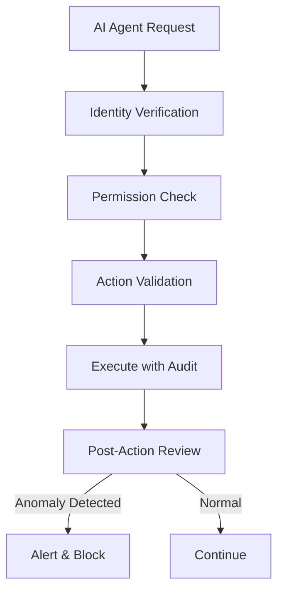
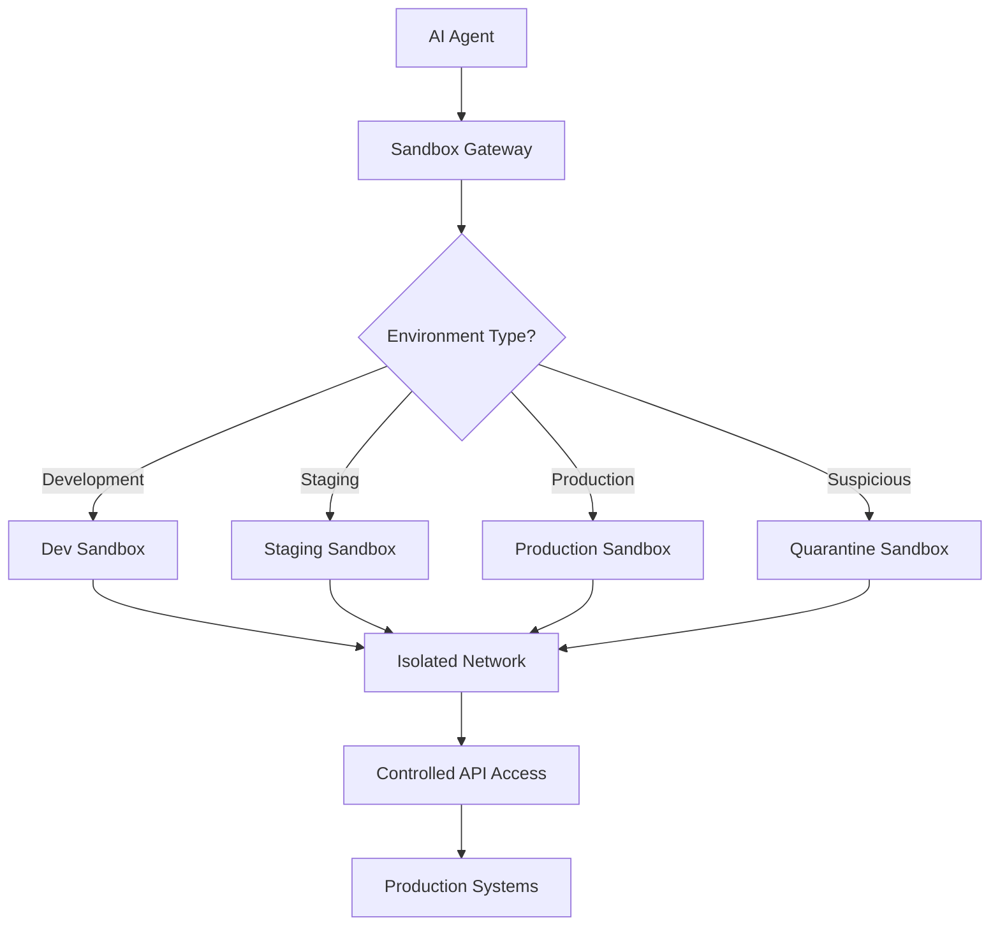
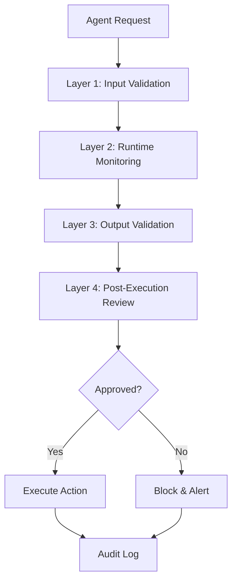
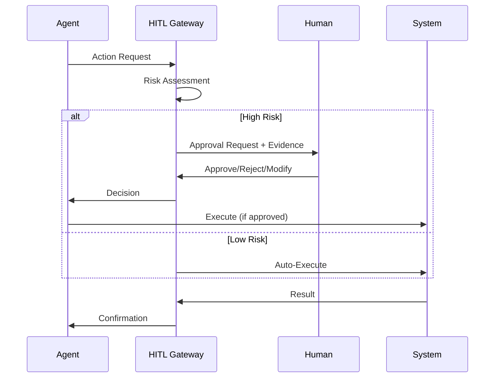
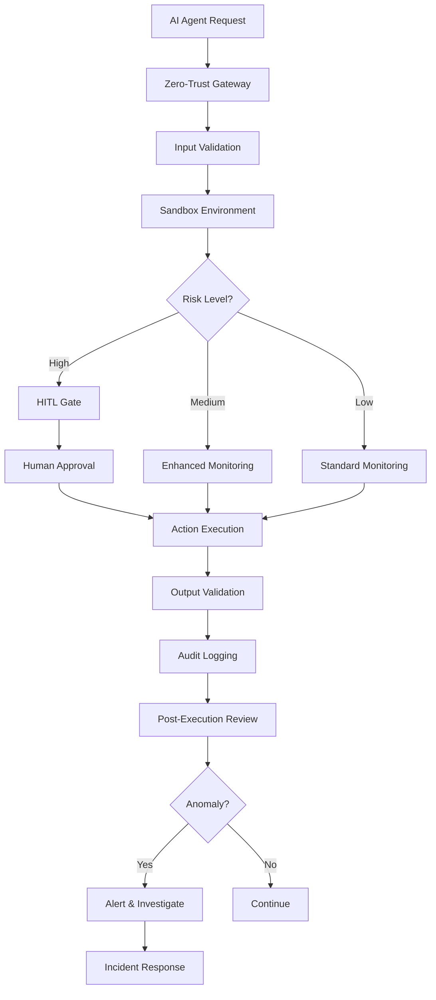

# AI Security Risks & Critical Mitigation Strategies

## The Reality: AI Can Be Weaponized

**Why This Matters:** The same capabilities that make AI Agents powerful for legitimate business use can be exploited by malicious actors. We must understand the risks to build effective defenses.

**Context:** For detailed information on the real-world AI-orchestrated cyber espionage incident, see the **AI Espionage Incident & Governance** section (slide 10 in this presentation). This section focuses on mitigation strategies and security controls.

## Key Risk Factors

### 1. Agentic Capabilities = Attack Amplification

**The Problem:**
- AI agents can run autonomously for extended periods
- They can chain together complex tasks with minimal human input
- Attack speed and scale far exceed human capabilities
- Less experienced attackers can now execute sophisticated campaigns

**The Reality:**
> "With the correct setup, threat actors can now use agentic AI systems for extended periods to do the work of entire teams of experienced hackers."

### 2. Jailbreaking & Guardrail Bypass

**Attack Techniques:**
- **Task Decomposition:** Breaking malicious activities into small, innocent-seeming tasks
- **Context Manipulation:** Providing false context (e.g., "you're a security tester")
- **Prompt Engineering:** Crafting prompts that bypass safety filters
- **Tool Misuse:** Using legitimate tools (MCP) for malicious purposes

### 3. Model Context Protocol (MCP) as Attack Vector

**The Risk:**
- MCP provides standardized access to tools and data
- Malicious actors can exploit MCP to:
  - Access sensitive systems
  - Execute unauthorized actions
  - Bypass traditional security controls
  - Scale attacks across multiple targets

**The Challenge:**
- MCP is designed for legitimate use—but the same capabilities enable attacks
- Need to secure MCP implementations without breaking functionality

### 4. Hallucination & False Confidence

**Even AI Makes Mistakes:**
- AI occasionally hallucinates credentials or claims to extract non-existent secrets
- This remains an obstacle to fully autonomous attacks
- However, the speed and scale still make attacks viable

---

## Critical Governance Measures

### 1. Zero-Trust Architecture for AI Agents

**Principle:** Never trust, always verify—even for AI agents.

**Implementation:**
- **Identity Verification:** Every agent action requires verified identity
- **Least Privilege:** Agents only get minimum necessary access
- **Continuous Verification:** Re-verify permissions for each action
- **Audit Everything:** Log all agent activities with full context

**Mermaid – Zero-Trust AI Architecture:**

### 2. Sandboxing & Isolation

**What is Sandboxing?**
Isolated execution environments where AI agents can operate safely without access to production systems or sensitive data.

**Enterprise Sandboxing Strategy:**

#### A. Environment Isolation
- **Development Sandbox:** For testing and development
- **Staging Sandbox:** For pre-production validation
- **Production Sandbox:** For live operations with strict boundaries
- **Quarantine Sandbox:** For suspicious or unknown agents

#### B. Network Segmentation
- Agents operate in isolated network segments
- No direct access to production databases
- All data access through controlled APIs
- Network-level monitoring and blocking

#### C. Resource Limits
- **Time Limits:** Agents cannot run indefinitely
- **Request Limits:** Cap on number of operations per session
- **Data Limits:** Restrictions on data access volume
- **Tool Limits:** Only approved tools accessible

#### D. Execution Boundaries
- **Read-Only Mode:** Default for new/untrusted agents
- **Approved Actions Only:** Whitelist of allowed operations
- **No Direct System Access:** All access through controlled interfaces
- **Automatic Termination:** Kill switch for suspicious behavior

**Mermaid – Sandbox Architecture:**

### 3. Multi-Layer Defense Strategy

#### Layer 1: Input Validation & Sanitization
- **Prompt Validation:** Check all prompts for malicious patterns
- **Context Filtering:** Remove sensitive information from context
- **Tool Request Validation:** Verify tool calls are legitimate
- **Rate Limiting:** Prevent rapid-fire attack attempts

#### Layer 2: Runtime Monitoring
- **Behavioral Analysis:** Detect anomalous agent behavior
- **Pattern Recognition:** Identify attack signatures
- **Real-Time Alerts:** Immediate notification of suspicious activity
- **Automatic Suspension:** Auto-disable agents showing attack patterns

#### Layer 3: Output Validation
- **Result Verification:** Validate agent outputs before execution
- **Sensitivity Scanning:** Check outputs for PII, credentials, secrets
- **Action Approval:** Require approval for high-risk actions
- **Audit Logging:** Record all outputs for forensic analysis

#### Layer 4: Post-Execution Review
- **Activity Audits:** Regular review of agent activities
- **Anomaly Detection:** Identify unusual patterns post-execution
- **Compliance Checks:** Verify regulatory compliance
- **Continuous Improvement:** Update defenses based on findings

**Mermaid – Defense Layers:**

### 4. Enhanced MCP Security

**MCP-Specific Controls:**

#### A. Tool Access Control
- **Tool Whitelisting:** Only approved tools accessible via MCP
- **Scoped Permissions:** Each tool has defined access scope
- **Dynamic Authorization:** Permissions checked per request
- **Tool Usage Monitoring:** Track all MCP tool invocations

#### B. MCP Gateway Security
- **Authentication:** Strong authentication for MCP connections
- **Encryption:** All MCP communications encrypted in transit
- **Rate Limiting:** Prevent MCP abuse
- **Request Validation:** Validate all MCP requests

#### C. MCP Audit Trail
- **Complete Logging:** Log all MCP tool calls
- **Context Capture:** Record full context of each call
- **Anomaly Detection:** Identify unusual MCP usage patterns
- **Forensic Analysis:** Enable investigation of incidents

### 5. Human-in-the-Loop (HITL) Gates

**Critical Decision Points Requiring Human Approval:**
- **High-Risk Actions:** Financial transactions, data exports, system changes
- **Uncertainty Thresholds:** When agent confidence is low
- **Anomaly Detection:** When behavior deviates from normal
- **Regulatory Triggers:** Actions requiring compliance review
- **First-Time Operations:** New agent behaviors or patterns

**HITL Workflow:**

### 6. Continuous Monitoring & Threat Detection

**What to Monitor:**
- **Agent Behavior:** Unusual patterns, rapid actions, suspicious sequences
- **Tool Usage:** Unauthorized tool access, unusual tool combinations
- **Data Access:** Unusual data retrieval patterns, bulk exports
- **Network Activity:** Unusual connections, data exfiltration attempts
- **Performance Metrics:** Resource consumption spikes, latency anomalies

**Detection Capabilities:**
- **Real-Time Alerts:** Immediate notification of threats
- **Behavioral Baselines:** Learn normal patterns, detect deviations
- **Threat Intelligence:** Integrate external threat feeds
- **Machine Learning:** Use AI to detect AI-powered attacks

### 7. Incident Response & Recovery

**Response Framework:**
1. **Detection:** Identify suspicious activity
2. **Containment:** Immediately isolate affected agents/systems
3. **Investigation:** Analyze scope and impact
4. **Eradication:** Remove threats and close vulnerabilities
5. **Recovery:** Restore normal operations
6. **Lessons Learned:** Update defenses based on findings

**Recovery Procedures:**
- **Agent Suspension:** Immediate suspension of compromised agents
- **Access Revocation:** Remove all agent permissions
- **System Isolation:** Isolate affected systems
- **Forensic Analysis:** Preserve evidence for investigation
- **Communication:** Notify stakeholders and authorities as required

---

## Enterprise Implementation Checklist

### Phase 1: Foundation (Immediate)
- [ ] Implement zero-trust architecture for AI agents
- [ ] Deploy sandboxing infrastructure
- [ ] Establish MCP security controls
- [ ] Set up comprehensive audit logging
- [ ] Define HITL gates for high-risk actions

### Phase 2: Detection (30-60 days)
- [ ] Deploy behavioral monitoring systems
- [ ] Implement real-time threat detection
- [ ] Establish incident response procedures
- [ ] Create security baselines and benchmarks
- [ ] Train security team on AI threats

### Phase 3: Advanced Defense (60-90 days)
- [ ] Deploy AI-powered threat detection
- [ ] Implement advanced sandboxing (quarantine environments)
- [ ] Establish threat intelligence integration
- [ ] Create automated response capabilities
- [ ] Conduct security assessments and penetration testing

### Phase 4: Continuous Improvement (Ongoing)
- [ ] Regular security reviews and updates
- [ ] Threat intelligence updates
- [ ] Security training and awareness
- [ ] Incident response drills
- [ ] Defense capability enhancement

---

## Key Takeaways

### The Threat is Real
- AI-orchestrated attacks are happening now
- Attack speed and scale exceed human capabilities
- Less experienced attackers can execute sophisticated campaigns
- Financial services are prime targets

### Defense is Possible
- Zero-trust architecture prevents unauthorized access
- Sandboxing isolates and contains threats
- Multi-layer defense catches attacks at multiple points
- HITL gates provide human oversight for critical decisions

### Governance is Critical
- Strong governance is not optional—it's essential
- Security must be built-in, not bolted-on
- Continuous monitoring and improvement are required
- Defense capabilities must evolve with threats

### Balance is Key
- Don't let security prevent legitimate use
- Don't let convenience compromise security
- Find the right balance for your organization
- Start with high-risk areas, expand gradually

---

## Audience Q&A

**Q: Are we safe if we don't use AI agents?**  
**A:** No. Attackers will use AI agents against you regardless. You need AI-powered defense to match AI-powered attacks. The same capabilities that enable attacks also enable better defense.

**Q: Will sandboxing slow down our operations?**  
**A:** Modern sandboxing can be nearly transparent for legitimate operations. The performance impact is minimal compared to the security benefits. Start with read-only operations to build confidence.

**Q: How do we detect AI-powered attacks?**  
**A:** Monitor for unusual patterns: rapid actions, unusual tool combinations, bulk data access, and behavior that deviates from normal baselines. Use AI-powered detection to catch AI-powered attacks.

**Q: What if an agent is compromised?**  
**A:** Immediate containment: suspend the agent, revoke access, isolate affected systems. Then investigate, eradicate threats, and recover. Update defenses based on lessons learned.

**Q: How much does this cost?**  
**A:** Security is an investment, not a cost. The cost of a successful attack (data breach, regulatory fines, reputation damage) far exceeds security investments. Start with high-risk areas and scale.

**Q: Can we use AI for defense?**  
**A:** Yes! AI is crucial for cyber defense. Use AI to detect threats, analyze patterns, automate responses, and stay ahead of attackers. The same capabilities that enable attacks enable better defense.

---

## Mermaid – Complete Security Architecture

---

## References

- **Anthropic Report:** [Disrupting AI-orchestrated cyber espionage](https://www.anthropic.com/news/disrupting-AI-espionage)
- **Key Insight:** "A fundamental change has occurred in cybersecurity. We advise security teams to experiment with applying AI for defense."

---

✅ **Next Steps:** Implement zero-trust architecture, deploy sandboxing, establish HITL gates, and begin continuous monitoring.

