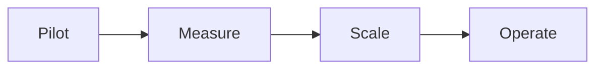

# Enterprise Adoption Strategy

## Phases
1) Pilot, 2) Measure ROI & risk, 3) Scale with governance, 4) Operate.

## Technology Foundation

**Our Stack (Currently in Development):**
- **Google ADK:** Agent framework and runtime (in development)
- **A2A:** Agent-to-agent communication protocol (in development)
- **AGUI:** Agent GUI framework (in development)
- **MCP:** Tool access protocol (built, awaiting deployment)
- **RAG:** Knowledge grounding (proven capability)

**Development Timeline:**
- **MCP:** Ready for deployment (awaiting higher environment approval)
- **Google ADK + A2A + AGUI:** Active development, targeting pilot readiness in 30-60 days
- **Integration:** Stack integration and testing ongoing

**Pilot Readiness:**
- Start with MCP-based pilots (read-only, low-risk use cases)
- Scale to ADK/A2A/AGUI stack as development completes
- Phased approach: MCP → ADK → A2A → AGUI → Full Stack

## SME Knowledge
- KPIs: time saved, accuracy (HITL pass rate), escalation rate, compliance findings prevented.
- **Technology:** Google ADK framework, A2A protocol, AGUI interface, MCP tool access, RAG knowledge grounding.

## Mermaid – Adoption Stages

## Audience Q&A
- **Q:** When do we see value?  
  **A:** Within 30–60 days for scoped pilots with available data and clear KPIs.
