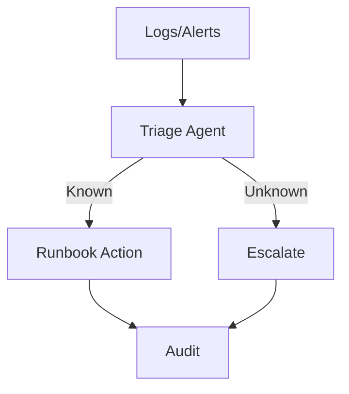

# AI in IT Operations (AIOps)

## What It Does
Detect anomalies, triage alerts, auto‑remediate known issues, escalate unknowns.

## SME Knowledge
- Data: logs/metrics/traces; runbooks; incident classification; SLOs.

## Mermaid – AIOps Flow

## Audience Q&A
- **Q:** Risk of false positives?  
  **A:** Start with read‑only/suggestions, calibrate thresholds, then allow safe automations.
