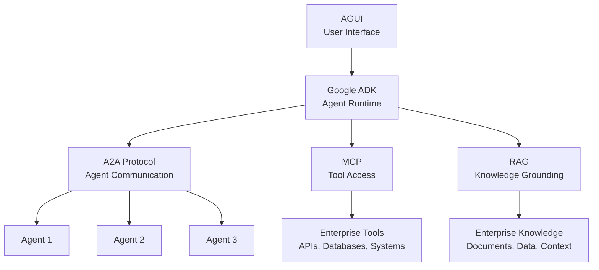

# Our Technology Stack — Google ADK, A2A, AGUI

## Current Development Status

**What We're Building:**
- **Google ADK (Agent Development Kit):** Our core framework for building and orchestrating AI agents
  - Provides agent runtime, messaging bus, tool calling, memory, observability
  - Enterprise-grade patterns for production deployment
  - Think of it as "Android for AI Agents" — standardized, scalable, secure

- **A2A (Agent-to-Agent Protocol):** Secure protocol for agent collaboration
  - Enables agents to communicate, delegate tasks, and coordinate
  - Built-in auth, audit, and trust mechanisms
  - Critical for multi-agent systems and complex workflows

- **AGUI (Agent GUI Framework):** User interface for agent interactions
  - Provides monitoring, control, and interaction capabilities
  - Enables human oversight and HITL gates
  - Essential for enterprise adoption and governance

- **MCP (Model Context Protocol):** Standardized tool access (built, awaiting deployment)
- **RAG (Retrieval-Augmented Generation):** Strong experience, grounding agents in enterprise knowledge

## Why This Stack Matters

**Enterprise Advantages:**
- **Standardization:** Open standards ensure interoperability and vendor flexibility
- **Security:** Built-in security, audit trails, and governance
- **Scalability:** Designed for multi-agent systems and enterprise scale
- **Production-Ready:** Google ADK provides battle-tested patterns

**Competitive Positioning:**
- We're building on cutting-edge, enterprise-grade technology
- Open standards (MCP, A2A) prevent vendor lock-in
- Google ADK provides production-ready foundation
- Strong RAG experience gives us knowledge grounding advantage

## Your Positioning
- **MCP:** Built and ready (awaiting higher environment)
- **Google ADK:** Actively developing agent framework
- **A2A:** Implementing agent-to-agent communication
- **AGUI:** Building user interface framework
- **RAG:** Strong experience and proven capability

## Mermaid – Technology Stack Architecture

## Development Roadmap

**Phase 1: MCP (Complete)**
- ✅ MCP built and ready
- ⏳ Awaiting higher environment deployment approval

**Phase 2: Google ADK (In Progress)**
- 🔄 Active development
- Target: Pilot-ready in 30-60 days

**Phase 3: A2A Integration (In Progress)**
- 🔄 Implementing agent-to-agent communication
- Target: Integrated with ADK in 30-60 days

**Phase 4: AGUI (In Progress)**
- 🔄 Building user interface framework
- Target: Integrated with ADK/A2A in 60-90 days

**Phase 5: Full Stack Integration**
- ⏳ Stack integration and testing
- Target: Production-ready in 90-120 days

## Audience Q&A

**Q: Why Google ADK instead of building our own?**  
**A:** Google ADK provides enterprise-grade patterns, production-ready infrastructure, and battle-tested agent runtime. Building our own would take years and lack the standardization benefits.

**Q: How does this compare to competitors?**  
**A:** We're building on cutting-edge, open standards (MCP, A2A) with enterprise-grade foundation (Google ADK). This gives us interoperability, security, and scalability advantages.

**Q: When will this be ready for pilots?**  
**A:** MCP is ready now. Google ADK + A2A targeting 30-60 days. AGUI targeting 60-90 days. We can start MCP-based pilots immediately, then scale to full stack.

**Q: What's the risk of building on Google ADK?**  
**A:** Low risk—Google ADK is open-source, uses open standards (MCP, A2A), and provides production-ready patterns. We're not locked into proprietary solutions.
