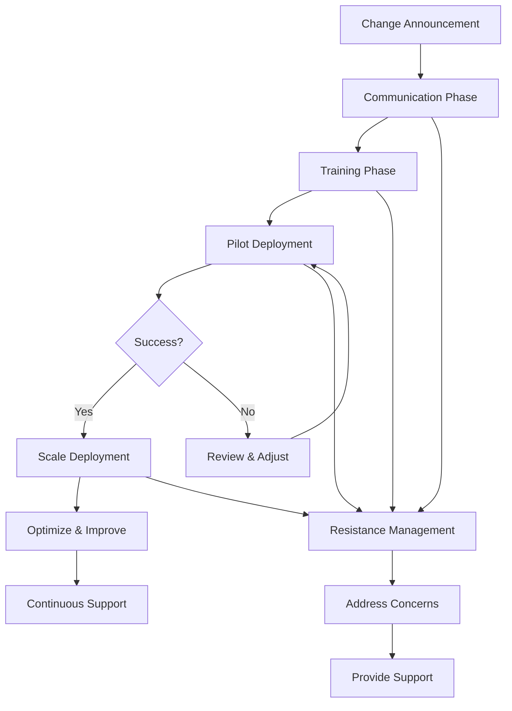

# Change Management & Organizational Impact

## Why This Matters
AI Agents will change how teams work. Without proper change management, adoption fails, resistance grows, and value is lost. We must address organizational impact proactively.

## Organizational Impact Assessment

### Roles That Will Change

#### 1. Payment Operations Teams
**Current State:**
- Manual review of payment exceptions
- Manual reconciliation
- Manual compliance checks

**Future State:**
- AI agents handle routine exceptions
- Teams focus on complex cases and exceptions
- Shift from execution to oversight

**Impact:**
- **Time Saved:** 40-60% reduction in manual work
- **Skill Shift:** From manual processing to exception handling and AI oversight
- **Training Needed:** AI agent monitoring, exception analysis, quality assurance

#### 2. Customer Service Teams
**Current State:**
- Handle all customer inquiries
- Manual ticket routing
- Repetitive question answering

**Future State:**
- AI agents handle routine inquiries
- Teams focus on complex issues and escalations
- Shift from reactive to proactive service

**Impact:**
- **Time Saved:** 50-60% reduction in routine ticket volume
- **Skill Shift:** From answering questions to problem-solving and relationship management
- **Training Needed:** AI agent collaboration, escalation handling, advanced problem-solving

#### 3. Compliance & Risk Teams
**Current State:**
- Manual document review
- Manual transaction monitoring
- Manual report generation

**Future State:**
- AI agents perform initial reviews
- Teams focus on exceptions and complex cases
- Shift from execution to governance

**Impact:**
- **Time Saved:** 60-70% reduction in manual review time
- **Skill Shift:** From manual review to AI oversight and governance
- **Training Needed:** AI governance, risk assessment, exception analysis

#### 4. IT Operations Teams
**Current State:**
- Manual incident triage
- Manual system monitoring
- Manual capacity planning

**Future State:**
- AI agents handle routine incidents
- Teams focus on complex issues and strategy
- Shift from firefighting to optimization

**Impact:**
- **Time Saved:** 70% reduction in false positives and routine incidents
- **Skill Shift:** From incident response to AI operations and optimization
- **Training Needed:** AIOps, AI agent management, advanced troubleshooting

### Roles That Will Emerge

#### 1. AI Agent Operators
**Responsibilities:**
- Monitor AI agent performance
- Handle exceptions and escalations
- Ensure quality and accuracy
- Optimize agent workflows

**Skills Required:**
- AI/ML basics
- Process understanding
- Quality assurance
- Problem-solving

**Training:** 2-4 weeks

#### 2. AI Governance Specialists
**Responsibilities:**
- Ensure compliance and governance
- Monitor AI risks
- Conduct audits and reviews
- Manage HITL gates

**Skills Required:**
- Regulatory knowledge (EU AI Act, GDPR, BaFin)
- Risk management
- Audit and compliance
- AI understanding

**Training:** 4-6 weeks

#### 3. AI Operations Engineers
**Responsibilities:**
- Deploy and maintain AI agents
- Monitor system health
- Optimize performance
- Troubleshoot issues

**Skills Required:**
- AI/ML engineering
- MCP expertise
- System operations
- Troubleshooting

**Training:** 6-8 weeks

---

## Change Management Strategy

### Phase 1: Communication (Weeks 1-2)

**Key Messages:**
- AI agents augment, not replace, human capabilities
- Focus shifts from routine tasks to value-added work
- New skills and opportunities emerge
- Change is gradual and supported

**Communication Channels:**
- All-hands meetings
- Team briefings
- Intranet updates
- Q&A sessions

**Deliverables:**
- Change announcement
- FAQ document
- Role evolution guide
- Training schedule

### Phase 2: Training (Weeks 3-8)

**Training Tracks:**

#### Track 1: AI Agent Users (All Affected Teams)
**Duration:** 2-4 weeks
**Content:**
- What are AI agents?
- How do they work?
- How to interact with agents
- How to monitor and review
- Exception handling

**Format:** Classroom + hands-on + online

#### Track 2: AI Agent Operators
**Duration:** 4-6 weeks
**Content:**
- AI agent operations
- Performance monitoring
- Quality assurance
- Exception management
- Workflow optimization

**Format:** Intensive training + mentorship

#### Track 3: AI Governance Specialists
**Duration:** 6-8 weeks
**Content:**
- Regulatory requirements (EU AI Act, GDPR, BaFin)
- AI governance framework
- Risk management
- Audit and compliance
- HITL gate management

**Format:** Classroom + certification + ongoing

### Phase 3: Pilot Deployment (Weeks 9-16)

**Approach:**
- Start with low-risk, high-value use cases
- Deploy in controlled environment
- Provide hands-on support
- Gather feedback and adjust

**Support Structure:**
- Dedicated support team
- Regular check-ins
- Feedback channels
- Issue resolution process

### Phase 4: Scale & Optimize (Weeks 17+)

**Approach:**
- Expand to additional use cases
- Optimize based on learnings
- Continuous improvement
- Knowledge sharing

**Support Structure:**
- Center of Excellence
- Best practices sharing
- Advanced training
- Continuous support

---

## Resistance Management

### Common Concerns & Responses

**Concern 1: "AI will replace my job"**
**Response:**
- AI handles routine tasks, freeing you for value-added work
- New roles emerge (AI operators, governance specialists)
- Focus shifts to exception handling, problem-solving, strategy
- Training and support provided for transition

**Concern 2: "I don't understand AI"**
**Response:**
- Training provided for all affected teams
- No deep technical knowledge required
- Focus on how to work with AI, not how to build it
- Support available throughout transition

**Concern 3: "AI will make mistakes"**
**Response:**
- HITL gates for high-risk decisions
- Human oversight and review
- Audit trails for all decisions
- Continuous monitoring and improvement

**Concern 4: "This is too fast"**
**Response:**
- Phased approach: pilot → scale → optimize
- Gradual rollout with support
- Time to learn and adapt
- Feedback incorporated continuously

### Resistance Mitigation Strategies

1. **Early Engagement:**
   - Involve teams in use case selection
   - Gather input on workflows
   - Address concerns proactively

2. **Transparency:**
   - Clear communication about changes
   - Honest about challenges and benefits
   - Regular updates on progress

3. **Support:**
   - Dedicated support team
   - Training and resources
   - Mentorship and guidance

4. **Recognition:**
   - Celebrate early adopters
   - Recognize contributions
   - Share success stories

---

## Success Metrics

### Adoption Metrics
- **Participation Rate:** % of teams using AI agents
- **Usage Frequency:** Number of agent interactions per day/week
- **User Satisfaction:** Survey scores on ease of use, value

### Performance Metrics
- **Time Savings:** Actual vs. expected time savings
- **Quality Improvement:** Error reduction, accuracy improvement
- **Productivity Gains:** Output per person, throughput

### Change Metrics
- **Training Completion:** % of team members trained
- **Resistance Level:** Survey scores on change acceptance
- **Support Utilization:** Help desk tickets, support requests

---

## Mermaid – Change Management Flow

---

## SME Knowledge
- Understand organizational structure and reporting lines
- Know team dynamics and potential resistance points
- Be prepared to address job security concerns
- Have training resources and support structure ready

## Audience Q&A

**Q: Will people lose their jobs?**  
**A:** No. AI agents handle routine tasks, freeing people for value-added work. New roles emerge (AI operators, governance specialists). We're augmenting, not replacing.

**Q: How long will the transition take?**  
**A:** Phased approach: 2-4 weeks communication, 4-8 weeks training, 8-16 weeks pilot, then gradual scale. Total: 4-6 months for full adoption.

**Q: What if people resist?**  
**A:** We address concerns proactively, provide training and support, involve teams in decisions, and celebrate early adopters. Resistance is normal—we manage it.

**Q: Who gets trained?**  
**A:** All affected teams get training. Different tracks for different roles: users (2-4 weeks), operators (4-6 weeks), governance specialists (6-8 weeks).

**Q: What support is available?**  
**A:** Dedicated support team, training resources, mentorship, help desk, regular check-ins, and continuous improvement based on feedback.

