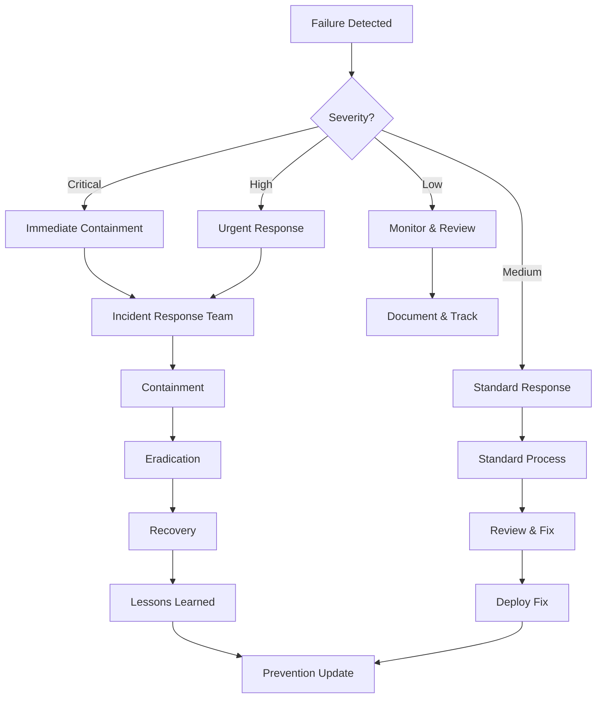

# Failure Scenarios & Contingency Plans

## Why This Matters
AI systems can fail. Managers need to know: What if something goes wrong? How do we recover? What are the contingency plans? This section addresses failure scenarios and recovery procedures.

## Failure Scenario Categories

### 1. AI Agent Decision Failures

#### Scenario: Wrong Decision Made
**What Happens:**
- AI agent makes incorrect decision (e.g., approves fraudulent transaction, rejects legitimate customer)
- Impact: Financial loss, customer dissatisfaction, compliance violation

**Detection:**
- Real-time monitoring alerts
- Customer complaints
- Audit review findings
- Quality assurance checks

**Contingency Plan:**
1. **Immediate:** Suspend affected agent, review decision
2. **Short-term:** Correct decision, notify affected parties
3. **Medium-term:** Root cause analysis, model retraining
4. **Long-term:** Update model, improve monitoring, prevent recurrence

**Prevention:**
- HITL gates for high-risk decisions
- Confidence thresholds (low confidence = human review)
- Regular model validation
- Continuous monitoring

#### Scenario: Agent Hallucination
**What Happens:**
- AI agent generates false information or makes up data
- Impact: Incorrect decisions, customer confusion, compliance issues

**Detection:**
- Output validation checks
- Customer feedback
- Audit reviews
- Data verification

**Contingency Plan:**
1. **Immediate:** Flag and review hallucinated outputs
2. **Short-term:** Correct information, notify affected parties
3. **Medium-term:** Improve prompt engineering, add validation layers
4. **Long-term:** Model fine-tuning, enhanced context engineering

**Prevention:**
- RAG (Retrieval-Augmented Generation) for grounded responses
- Output validation and fact-checking
- Confidence scoring
- Human review for critical outputs

### 2. Security Failures

#### Scenario: Agent Compromised
**What Happens:**
- Malicious actor gains control of AI agent
- Agent performs unauthorized actions (data exfiltration, system changes)
- Impact: Data breach, system compromise, regulatory violation

**Detection:**
- Security monitoring alerts
- Anomaly detection
- Audit log reviews
- Behavioral analysis

**Contingency Plan:**
1. **Immediate:** Isolate agent, revoke access, suspend operations
2. **Short-term:** Investigate scope, contain damage, notify security team
3. **Medium-term:** Eradicate threat, close vulnerabilities, restore systems
4. **Long-term:** Enhance security controls, update incident response, prevent recurrence

**Prevention:**
- Zero-trust architecture
- Sandboxing and isolation
- Continuous monitoring
- Regular security assessments

#### Scenario: Data Breach via AI Agent
**What Happens:**
- AI agent inadvertently exposes sensitive data
- Data accessed by unauthorized parties
- Impact: GDPR violation, customer trust loss, regulatory fines

**Detection:**
- Data access monitoring
- Anomaly detection
- Audit log reviews
- Customer reports

**Contingency Plan:**
1. **Immediate:** Stop data access, assess scope, notify security team
2. **Short-term:** Contain breach, notify affected parties (GDPR requirement: 72 hours)
3. **Medium-term:** Investigate root cause, close vulnerabilities, restore security
4. **Long-term:** Enhance data protection, update controls, prevent recurrence

**Prevention:**
- Data minimization (only necessary data)
- PII redaction in context
- Access controls and encryption
- Regular data protection assessments

### 3. System Failures

#### Scenario: Agent System Outage
**What Happens:**
- AI agent platform fails or becomes unavailable
- Agents cannot process requests
- Impact: Service disruption, customer impact, operational delays

**Detection:**
- System monitoring alerts
- Customer complaints
- Service availability metrics

**Contingency Plan:**
1. **Immediate:** Activate fallback processes (manual processing)
2. **Short-term:** Restore service, process backlog
3. **Medium-term:** Root cause analysis, system improvements
4. **Long-term:** Redundancy, failover mechanisms, disaster recovery

**Prevention:**
- High availability architecture
- Redundancy and failover
- Regular disaster recovery drills
- Service level agreements (SLAs)

#### Scenario: Model Performance Degradation
**What Happens:**
- AI model accuracy decreases over time (model drift)
- Decisions become less reliable
- Impact: Increased errors, customer dissatisfaction, compliance issues

**Detection:**
- Performance monitoring
- Quality metrics tracking
- Customer feedback
- Audit reviews

**Contingency Plan:**
1. **Immediate:** Increase HITL gates, add human oversight
2. **Short-term:** Retrain model, update with new data
3. **Medium-term:** Deploy updated model, validate performance
4. **Long-term:** Continuous monitoring, regular retraining, model versioning

**Prevention:**
- Continuous performance monitoring
- Regular model validation
- Automated retraining pipelines
- Model versioning and rollback

### 4. Compliance Failures

#### Scenario: EU AI Act Violation
**What Happens:**
- AI system fails to meet EU AI Act requirements
- Regulatory violation identified
- Impact: Fines (up to €35M or 7% revenue), reputational damage

**Detection:**
- Compliance audits
- Regulatory reviews
- Internal assessments

**Contingency Plan:**
1. **Immediate:** Assess violation scope, suspend non-compliant operations
2. **Short-term:** Remediate violations, document fixes
3. **Medium-term:** Update governance framework, enhance controls
4. **Long-term:** Continuous compliance monitoring, regular audits

**Prevention:**
- Proactive compliance assessment
- Governance framework
- Regular audits
- Compliance training

#### Scenario: GDPR Violation
**What Happens:**
- AI system violates GDPR (e.g., automated decision without human review)
- Data protection authority investigation
- Impact: Fines (up to €20M or 4% revenue), customer trust loss

**Detection:**
- Compliance monitoring
- Customer complaints
- Regulatory inquiries

**Contingency Plan:**
1. **Immediate:** Stop violating operations, assess scope
2. **Short-term:** Remediate violations, notify authorities if required (72-hour rule)
3. **Medium-term:** Update data protection measures, enhance controls
4. **Long-term:** Continuous GDPR compliance, regular assessments

**Prevention:**
- GDPR by design
- Data protection impact assessments (DPIA)
- Human oversight for automated decisions
- Regular compliance reviews

### 5. Business Impact Failures

#### Scenario: Customer Service Degradation
**What Happens:**
- AI agent provides poor customer service
- Customer satisfaction decreases
- Impact: Customer churn, reputation damage, revenue loss

**Detection:**
- Customer satisfaction metrics
- Customer complaints
- Quality monitoring

**Contingency Plan:**
1. **Immediate:** Increase human oversight, improve agent responses
2. **Short-term:** Retrain model, update prompts, enhance context
3. **Medium-term:** Deploy improved agent, validate customer satisfaction
4. **Long-term:** Continuous improvement, customer feedback integration

**Prevention:**
- Quality monitoring
- Customer feedback loops
- Regular model updates
- Human oversight for critical interactions

#### Scenario: Operational Disruption
**What Happens:**
- AI agent causes operational disruption (e.g., incorrect payment processing)
- Business processes affected
- Impact: Financial loss, customer impact, operational delays

**Detection:**
- Operational monitoring
- Error alerts
- Business impact metrics

**Contingency Plan:**
1. **Immediate:** Suspend agent, activate manual processes, correct errors
2. **Short-term:** Root cause analysis, fix issues, restore operations
3. **Medium-term:** Improve agent, enhance monitoring, prevent recurrence
4. **Long-term:** Continuous improvement, operational excellence

**Prevention:**
- Thorough testing before deployment
- Gradual rollout (pilot → scale)
- HITL gates for critical operations
- Continuous monitoring

---

## Incident Response Framework

### Phase 1: Detection & Assessment (0-2 hours)
**Actions:**
- Detect incident (monitoring, alerts, reports)
- Assess severity and scope
- Classify incident type
- Activate incident response team

**Deliverables:**
- Incident report
- Severity classification
- Initial impact assessment

### Phase 2: Containment (2-24 hours)
**Actions:**
- Isolate affected systems/agents
- Stop ongoing damage
- Preserve evidence
- Notify stakeholders

**Deliverables:**
- Containment report
- Evidence preservation
- Stakeholder notifications

### Phase 3: Eradication (24-72 hours)
**Actions:**
- Remove threat/vulnerability
- Fix root cause
- Restore systems
- Validate fixes

**Deliverables:**
- Root cause analysis
- Fix validation
- System restoration

### Phase 4: Recovery (72 hours - 1 week)
**Actions:**
- Restore normal operations
- Monitor for recurrence
- Validate business processes
- Communicate status

**Deliverables:**
- Recovery report
- Business validation
- Status communication

### Phase 5: Lessons Learned (1-2 weeks)
**Actions:**
- Post-incident review
- Document lessons learned
- Update procedures
- Improve prevention

**Deliverables:**
- Lessons learned report
- Updated procedures
- Prevention improvements

---

## Rollback Procedures

### When to Rollback
- **Severe Errors:** Critical business impact, data loss, security breach
- **Performance Issues:** System degradation, unacceptable errors
- **Compliance Violations:** Regulatory violations, GDPR breaches
- **Customer Impact:** Significant customer dissatisfaction, churn risk

### Rollback Process

#### Step 1: Decision
- **Who:** Incident response team, business owner
- **Criteria:** Severity, impact, risk assessment
- **Timeline:** Immediate for critical issues

#### Step 2: Execution
- **Actions:**
  - Suspend AI agent operations
  - Activate fallback processes (manual)
  - Restore previous system state
  - Validate rollback

#### Step 3: Communication
- **Stakeholders:** Business owners, customers (if affected), regulators (if required)
- **Message:** Clear explanation of issue, rollback, and next steps
- **Timeline:** Immediate for critical issues

#### Step 4: Recovery
- **Actions:**
  - Root cause analysis
  - Fix development
  - Testing and validation
  - Gradual re-deployment

---

## Mermaid – Failure Response Flow

---

## Prevention Strategies

### 1. Proactive Monitoring
- Real-time performance monitoring
- Anomaly detection
- Quality metrics tracking
- Security monitoring

### 2. Testing & Validation
- Thorough testing before deployment
- Model validation
- Security testing
- Compliance validation

### 3. Gradual Rollout
- Pilot → Scale → Production
- Phased deployment
- Continuous monitoring
- Feedback integration

### 4. Governance & Controls
- HITL gates for high-risk decisions
- Audit trails for all actions
- Regular reviews and audits
- Compliance monitoring

---

## SME Knowledge
- Understand incident response procedures
- Know escalation paths and decision-makers
- Be prepared to activate fallback processes
- Have rollback procedures ready

## Audience Q&A

**Q: What if an agent makes a wrong decision?**  
**A:** We have HITL gates for high-risk decisions, real-time monitoring, and rollback procedures. Wrong decisions are caught early, corrected, and used to improve the system.

**Q: What if there's a security breach?**  
**A:** Immediate containment (isolate agent, revoke access), investigation, eradication, and recovery. We have zero-trust architecture, sandboxing, and continuous monitoring to prevent breaches.

**Q: What if the system goes down?**  
**A:** Fallback to manual processes, restore service, and investigate root cause. We have redundancy, failover, and disaster recovery procedures.

**Q: What if we violate regulations?**  
**A:** Immediate remediation, compliance assessment, and prevention improvements. We have proactive compliance monitoring and governance to prevent violations.

**Q: Can we rollback if something goes wrong?**  
**A:** Yes. We have rollback procedures for all deployments. Critical issues trigger immediate rollback, with fallback to manual processes while we fix the issue.

