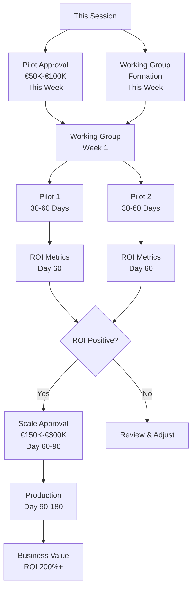

# Closing & Call to Action

## Key Message
AI Agents + MCP + Agentic AI = Strategic lever for EMEA. The threat is real, the opportunity is clear, and the time to act is now.

## Specific Asks (With Dates & Budgets)

### Immediate Decision Required (This Week)
**Decision 1: Pilot Approval**
- **What:** Approve 1–2 low-risk pilots (Payment Exception Handling or Customer Inquiry Resolution)
- **Budget:** €50,000 - €100,000 per pilot
- **Timeline:** 30-60 days to demonstrate ROI
- **Success Criteria:** 40%+ time savings, positive ROI within 60 days
- **Decision Deadline:** [Insert specific date - e.g., "Friday, [Date]"]

**Decision 2: Working Group Formation**
- **What:** Form AI Agents Working Group with representation from:
  - IT Operations (you as POC)
  - Compliance & Risk
  - Product Management
  - Security
- **Commitment:** 2 hours/week for 3 months
- **First Meeting:** [Insert specific date - e.g., "Week of [Date]"]
- **Deliverable:** Pilot selection and KPI definition within 2 weeks

### Short-Term Commitments (30 Days)
**Decision 3: Governance Framework Approval**
- **What:** Approve AI governance framework and risk classification
- **Budget:** €30,000 - €60,000 (one-time setup)
- **Timeline:** Framework ready within 30 days
- **Decision Deadline:** [Insert specific date]

**Decision 4: Resource Allocation**
- **What:** Allocate 1-2 FTE for pilot development
- **Duration:** 3-6 months
- **Skills Required:** AI/ML engineering, MCP expertise
- **Decision Deadline:** [Insert specific date]

### Medium-Term Vision (60-90 Days)
**Decision 5: Scale Approval (Conditional)**
- **What:** Approve scale deployment if pilots succeed
- **Budget:** €150,000 - €300,000
- **Condition:** Positive ROI demonstrated, governance validated
- **Decision Point:** Review at 60-day milestone

## Decision Matrix

| Decision | Budget | Timeline | Risk Level | ROI Timeline |
|----------|--------|----------|------------|--------------|
| Pilot Approval | €50K-€100K | 30-60 days | Low | 60 days |
| Working Group | Time only | Immediate | None | N/A |
| Governance Framework | €30K-€60K | 30 days | Low | Ongoing |
| Resource Allocation | 1-2 FTE | 3-6 months | Medium | 60-90 days |
| Scale (if successful) | €150K-€300K | 60-120 days | Medium | 6 months |

## What Happens If We Approve

### 30 Days
- Working group operational
- Pilot use cases selected
- Governance framework drafted
- Team allocated

### 60 Days
- Pilot deployed and operational
- Initial ROI metrics available
- Governance framework approved
- Security controls validated

### 90 Days
- Pilot ROI validated (target: 40%+)
- Scale decision point
- Lessons learned documented
- Next use cases identified

### 180 Days
- Multiple use cases in production
- Measurable business impact
- Governance framework proven
- Competitive advantage demonstrated

## What Happens If We Delay

### Competitive Risk
- Competitors gain 6-12 month advantage
- Market share erosion begins
- Customer expectations exceed our capabilities

### Regulatory Risk
- EU AI Act compliance deadline approaches (2026)
- Reactive compliance = higher costs
- Potential fines: €1M - €10M+ exposure

### Operational Risk
- Manual processes become unsustainable
- Error rates increase
- Customer service quality degrades

**Cost of 6-Month Delay:** Estimated €2M - €5M in opportunity cost + competitive disadvantage

## Mermaid – From Session to Value

## Your Commitment

**What We Need From You:**
1. **Pilot approval** (€50K-€100K) by [Date]
2. **Working group participation** (2 hours/week, 3 months)
3. **Governance framework review** (1 hour, within 30 days)
4. **Resource allocation decision** (1-2 FTE, within 30 days)

**What You Get:**
1. **Clear ROI** within 60 days
2. **Measurable business impact** (40%+ time savings)
3. **Competitive advantage** (6-12 month lead)
4. **Regulatory compliance** (proactive vs. reactive)
5. **Risk mitigation** (security, governance, controls)

## Next Steps

### This Week
- [ ] Approve pilot budget (€50K-€100K)
- [ ] Confirm working group participants
- [ ] Schedule first working group meeting

### Next 30 Days
- [ ] Review and approve governance framework
- [ ] Allocate resources (1-2 FTE)
- [ ] Select pilot use cases
- [ ] Define success metrics and KPIs

### Next 60 Days
- [ ] Deploy pilots
- [ ] Measure ROI
- [ ] Review results
- [ ] Make scale decision

## Audience Q&A

**Q: What do you need next?**  
**A:** Pilot approval (€50K-€100K) and working group formation this week. Governance framework review within 30 days. Resource allocation decision within 30 days.

**Q: What if the pilot fails?**  
**A:** We start with low-risk, read-only use cases. Even if ROI is lower than expected, we'll learn valuable lessons. The investment is small compared to the cost of delay.

**Q: How do we know this will work?**  
**A:** We have proven use cases, clear success metrics, and a phased approach. Start small, measure, then scale. This is how successful AI adoption works.

**Q: What's the worst-case scenario?**  
**A:** Worst case: We invest €100K, learn valuable lessons, and adjust. This is far better than doing nothing and losing competitive advantage.

**Q: Can we start smaller?**  
**A:** Yes—we can start with a single use case at €50K. The key is to start and learn, not to wait for perfect conditions.
