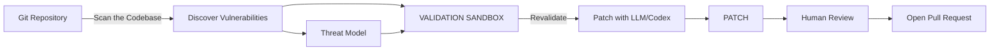

# 📄 Project Requirement Prompt (PRP) — “AARDVARK-style Vulnerability Discovery Agent”

You are an experienced **Senior AI + Security Engineer** tasked to implement an **autonomous, multi-stage vulnerability discovery and patching agent** similar in workflow to “AARDVARK — Vulnerability Discovery Agent Workflow”.  
Your goal is to generate **production-grade, SOLID-compliant Python services** (FastAPI preferred) that can be run locally or in containers, and that can integrate with **Azure OpenAI** or any compatible LLM.

Build the system with the following requirements.

---

## 1. Problem Statement
We want an AI-assisted pipeline that:
1. **Pulls code** from a Git repository (GitLab/GitHub/self-hosted).
2. **Scans the codebase** for security issues.
3. **Generates a threat model** for the identified components.
4. **Discovers and ranks vulnerabilities** using both static signals and LLM reasoning.
5. **Validates findings in a sandbox** (dry run / test harness / security rules).
6. **Autogenerates patches with an LLM (“Patch with Codex” step)**.
7. **Re-validates** the patched code in the sandbox.
8. **Prepares a human-readable report** and **optionally opens a Pull/Merge Request**.
9. **Keeps a human in the loop** at the final step.

This pipeline must be **deterministic in structure** (stages are clear) but **AI-assisted in content** (analysis, patch suggestions, threat modeling).

---

## 2. Target Workflow (mirror the diagram)

Recreate the following flow as code and APIs:

1. **GIT REPOSITORY (source)**  
   Input: repo URL, branch, optional path filters, access token.  
   Action: clone/shallow clone/download archive.  
   Output: local working directory + repo metadata.

2. **Scan the Codebase**  
   Static scan: run pluggable scanners (Bandit, Semgrep, Trivy for IaC, etc.) — make these *interfaces*, not hardcoded.  
   LLM scan: send code summaries/chunks to LLM to detect non-signature vulnerabilities (insecure deserialization, hardcoded secrets, weak JWT, direct SQL, SSRF).  
   Output: **vulnerability candidates** (list with file, line, rule/source, confidence, evidence).

3. **Discover Vulnerabilities**  
   Aggregate static + LLM findings.  
   Deduplicate and group by component.  
   Enrich with CWE / OWASP ASVS / OWASP Top 10 tags.  
   Output: normalized `VulnerabilityFinding` objects.

4. **THREAT MODEL (enrichment loop)**  
   For the project / service / module, ask LLM to draft a lightweight threat model: assets, trust boundaries, entry points, potential STRIDE categories, likely exploit paths.  
   Map each finding to threat model nodes to derive **risk** and **priorities**.  
   Output: list of prioritized findings with risk score.

5. **VALIDATION SANDBOX**  
   Create an abstraction `ValidationBackend` that can:
   - run unit/integration tests,
   - run SAST again on patched code,
   - run policy-as-code checks (e.g. Open Policy Agent),
   - optionally run a security harness (mock exploit).  
   This step is **re-entrable** (must support “Revalidate” after patch).  
   Output: pass/fail + diagnostics.

6. **Patch With LLM (“Patch with Codex”)**  
   For each validated/high-priority vulnerability:
   - build a **patch prompt** = (file snippet + vulnerability description + tool findings + language/framework + secure coding guide)
   - call LLM (Azure OpenAI GPT-4o/4.1/codex-like, or Anthropic) to produce:
     - patched file segment
     - explanation
     - tests to add
   - keep original file for diff.  
   Output: candidate patches.

7. **PATCH (materialize)**  
   Apply patch to workspace.  
   Re-run **VALIDATION SANDBOX**.  
   If pass → mark as “auto-fixable”.  
   If fail → send back to LLM with diagnostics (second attempt).

8. **Human Review & PR**  
   Generate a final report (Markdown + JSON):
   - findings
   - threat model
   - patches applied
   - tests run
   - residual risks  
   Optionally create a PR/MR in Git provider.  
   Human must be able to override, reject, or edit patches.

---

## 3. System Decomposition (Services / Agents)

Implement as **three to five** logical services/agents (can be separate FastAPI apps or one app with modules):

- **repo_service** – clone/fetch repo, expose `/repos/clone`, `/repos/status`  
- **scan_service** – static + llm scanners, expose `/scan/full`  
- **threat_service** – builds contextual threat model using LLM  
- **validation_service** – run validation checks, expose `/validate`  
- **patch_service** – prompt builder + LLM caller, expose `/patch/generate`, `/patch/apply`  
- **orchestrator** – runs all steps sequentially, can later integrate with Prefect/LangGraph/A2A/MCP.

---

## 4. LLM / Provider Abstraction

Create an interface, e.g. `LLMClient` with methods:
- `complete(prompt)`  
- `chat(messages)`  
- `structured(output_schema, messages)`  

Implement `AzureOpenAIClient` first, make it easy to switch to Anthropic/OpenAI/local vLLM.

---

## 5. Example Data Models

```python
class VulnerabilityFinding(BaseModel):
    id: str
    file_path: str
    line_start: int
    line_end: int
    description: str
    cwe: Optional[str]
    owasp: Optional[str]
    source: str
    confidence: float
    severity: str
```

---

## 6. Observability & Quality

### 6.1 Structured Logging
- Structured logging with `trace_id`, `repo`, `stage`, `scan_job_id`
- Log levels: DEBUG, INFO, WARNING, ERROR, CRITICAL
- Log aggregation support (JSON format for ELK, Splunk, etc.)
- Context propagation across service boundaries
- Audit logging for security-critical actions (who ran what scan, when, patches applied)

### 6.2 Monitoring & Metrics
- **Metrics Collection** (Prometheus-compatible):
  - Scan duration (per stage, total)
  - Vulnerabilities found (by severity, by source)
  - Patch generation success/failure rate
  - Validation pass/fail rate
  - LLM token usage and costs per scan
  - Queue depth and worker utilization
  - Error rates by error type
- **Metrics Endpoints**: Expose `/metrics` endpoint for Prometheus scraping
- **Health Checks**: Expose `/health` and `/ready` endpoints for:
  - Service availability
  - Database connectivity
  - LLM provider connectivity
  - Queue system status

### 6.3 Alerting
- **Alert Thresholds** (configurable):
  - Too many high-severity findings detected
  - Scan duration exceeds SLA threshold
  - Error rate exceeds threshold
  - LLM quota exhaustion warnings
  - Patch generation failure rate spikes
- **Alert Channels**: Support for Slack, email, PagerDuty, webhooks
- **Alert Format**: Include scan job ID, repo, severity, actionable context

### 6.4 Error Handling
- Comprehensive error taxonomy:
  - `NetworkError` (repo clone failures, LLM API timeouts)
  - `LLMError` (quota exceeded, invalid response format)
  - `ScannerError` (tool execution failures, parser errors)
  - `ValidationError` (test failures, policy violations)
  - `PatchError` (syntax errors, merge conflicts)
- Graceful degradation (if one scanner fails, continue with others)
- Error recovery strategies per error type
- Partial failure handling (return partial results when applicable)

---

## 7. Non-Functional Requirements

### 7.1 Technology Stack
- Python 3.10+, FastAPI, Docker Compose
- Database: PostgreSQL or SQLite (for job state, findings history)
- Queue System: Redis + Celery/RQ (for async job processing)
- Caching: Redis (for LLM responses, scan results)
- Secret Management: AWS Secrets Manager / Azure Key Vault / HashiCorp Vault

### 7.2 Configuration Management
- **Environment-Specific Configs**: Support dev, staging, prod environments
- **Configuration Sources** (priority order):
  1. Environment variables (highest priority)
  2. YAML config files (`config/`)
  3. Default values in code
- **Configuration Categories**:
  - Scanner configuration (enable/disable specific rules, tool paths)
  - LLM provider settings (model selection, temperature, max tokens per environment)
  - Feature flags (enable/disable auto-patching, threat modeling)
  - Resource limits (max_files, max_size_mb, timeout_seconds, max_concurrent_scans)
  - Repository access settings (allowed domains, token rotation)
- **Configuration Schema**: Use Pydantic Settings for type-safe configuration
- **Configuration Validation**: Validate on startup, fail fast with clear error messages

### 7.3 Scalability & Performance
- **Horizontal Scaling**:
  - Stateless service design (state in database/queue)
  - Multiple worker instances for parallel scan processing
  - Load balancer support for API endpoints
- **Queue System**:
  - Redis/RabbitMQ for async job queue
  - Priority queues (high-severity findings processed first)
  - Dead letter queue for failed jobs
  - Job retry with exponential backoff
- **Caching Strategy**:
  - Cache LLM responses for identical code patterns (hash-based)
  - Cache scan results for unchanged code (git commit hash-based)
  - Cache threat models (invalidate on major code changes)
  - TTL-based cache expiration
- **Resource Management**:
  - Per-scan resource limits (CPU, memory, timeout)
  - Worker pool configuration (max concurrent scans per worker)
  - Rate limiting on API endpoints (prevent abuse)
  - Memory-efficient code chunking for large repos
- **Performance Targets**:
  - Scan job startup < 5 seconds
  - API response time < 200ms (for status checks)
  - Support repos up to 10k files, 500MB uncompressed
  - Handle 10+ concurrent scan jobs per worker

### 7.4 Storage & Artifacts
- **Artifact Storage Interface** (`ArtifactStorage`):
  - Implementations: Local filesystem, S3, Azure Blob Storage
  - Store scan reports, patch diffs, validation artifacts
- **Storage Structure**:
  ```
  artifacts/
    {scan_job_id}/
      report.md
      report.json
      patches/
        {vulnerability_id}.patch
      validation/
        test_results.json
        logs/
  ```
- **Artifact Formats**:
  - Markdown report (human-readable)
  - JSON report (machine-readable)
  - SARIF format (for tool interoperability)
  - JUnit XML (for CI/CD integration)
  - PDF export (optional)
- **Retention Policy**:
  - Configurable retention period (default: 90 days)
  - Automatic cleanup of expired artifacts
  - Archive old scans (move to cold storage)
  - Artifact compression for large reports

### 7.5 Security Requirements
- Secure secret management (never hardcode API keys, tokens)
- RBAC (Role-Based Access Control):
  - Roles: admin, scanner, reviewer, viewer
  - Permission model: who can trigger scans, generate patches, approve PRs
- Input validation and sanitization:
  - Validate repo URLs (prevent SSRF)
  - Sanitize file paths (prevent path traversal)
  - Rate limiting on all user-facing endpoints
- Sandbox isolation:
  - Patches must not execute arbitrary code
  - Validation runs in isolated containers/VMs
  - Network isolation for sandbox environments
- Audit logging for all security-critical operations

### 7.6 Pluggable Architecture
- Pluggable scanners (interface-based, not hardcoded)
- Validation abstraction (multiple backends)
- Extensible prompts (versioned, externalized)
- Provider-agnostic LLM client (easy to switch providers)

---

## 8. CI/CD Integration

### 8.1 Webhook Support
- **Webhook Handler**: `/webhooks/gitlab`, `/webhooks/github`, `/webhooks/generic`
- **Triggers**: On push, pull request open/update, tag creation
- **Webhook Security**: Validate webhook signatures (GitHub secret, GitLab token)
- **Event Filtering**: Configurable branch patterns, path filters (monorepo support)

### 8.2 Pre-Commit Hook Option
- Optional Git pre-commit hook script
- Quick scan mode (fast, lightweight checks only)
- Block commit if critical findings detected (configurable)

### 8.3 CI/CD Pipeline Integration
- **Blocking Behavior**: Option to block merge if critical/high-severity findings exist
- **Gate Configuration**: Per-project rules (which severities block, which scanners required)
- **Status Checks**: Report scan status via Git provider Status API
- **PR Comments**: Auto-comment on PRs with scan results summary

### 8.4 Reporting Integration
- **Notifications**: Send scan results to:
  - Slack channels (with formatted messages)
  - Email (HTML reports)
  - Jira tickets (create/update issues for findings)
  - Webhooks (custom integrations)
- **Report Formats**: Configurable output (summary vs. detailed)
- **Notification Rules**: Alert only on new findings, high severity, or configurable thresholds

### 8.5 Integration Abstractions
- `WebhookHandler` interface for git provider-specific logic
- `CIIntegrator` interface for CI system integration
- `NotificationSender` interface for multi-channel notifications

---

## 9. Outputs / Deliverables

### 9.1 Folder Structure
```
aardvark-agent/
  services/
    repo_service/
    scan_service/
    threat_service/
    validation_service/
    patch_service/
    orchestrator/
  common/
    llm/
    models/
    config/
    storage/
    notifications/
  tests/
    unit/
    integration/
    e2e/
    fixtures/
  docker/
    Dockerfile
    docker-compose.yml
    docker-compose.prod.yml
  config/
    dev.yaml
    staging.yaml
    prod.yaml
  prompts/
    vulnerability_detection.md
    threat_modeling.md
    patch_generation.md
  docs/
    api/
    architecture/
    deployment/
    troubleshooting/
```

### 9.2 Deliverables
- FastAPI apps for all services
- OpenAPI/Swagger documentation
- Docker images and docker-compose configuration
- Prompts in Markdown/YAML format (versioned)
- Mermaid diagrams (workflow, architecture)
- Example API calls and integration scripts
- Deployment guides (local, containerized, cloud)
- Configuration reference documentation

---

## 10. Mermaid Diagram



---

## 11. Acceptance Criteria

### 11.1 Functional Requirements
- `docker compose up` starts all services successfully
- `/vuln-discovery/run` accepts repo URL, token, and optional configuration
- Returns vulnerability list, patches, validation results, Markdown report
- Human review API available (`/review/approve`, `/review/reject`, `/review/edit`)
- All services expose health check endpoints (`/health`, `/ready`)

### 11.2 Operational Requirements
- Metrics endpoint (`/metrics`) exposes Prometheus-compatible metrics
- Configuration loaded from environment variables and YAML files
- Secrets retrieved from secure vault (not hardcoded)
- Artifacts stored in configured storage backend (local/S3/Azure)
- Queue system handles job failures with retry logic
- Scan state persisted in database (survives service restarts)

### 11.3 Integration Requirements
- Webhook endpoints accept GitLab/GitHub webhook events
- CI/CD integration blocks merges on critical findings (when configured)
- Notifications sent to Slack/email/webhook on scan completion
- Reports exportable in multiple formats (JSON, SARIF, Markdown, PDF)

### 11.4 Performance Requirements
- Scan job startup time < 5 seconds
- API response time < 200ms for status endpoints
- Supports repos up to 10k files, 500MB uncompressed
- Handles 10+ concurrent scan jobs per worker instance

---

## 12. Notes / Constraints

- Provider-agnostic, modular, observable, secure.  
- Mock where necessary, avoid vendor lock-in.  
- All prompts externalized to Markdown/YAML.

---
