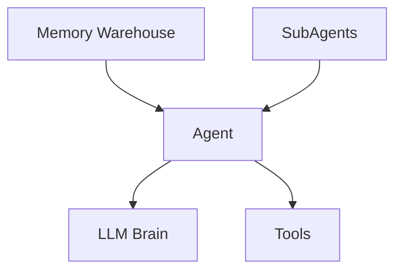
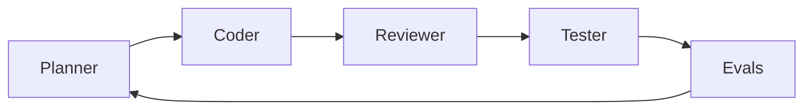
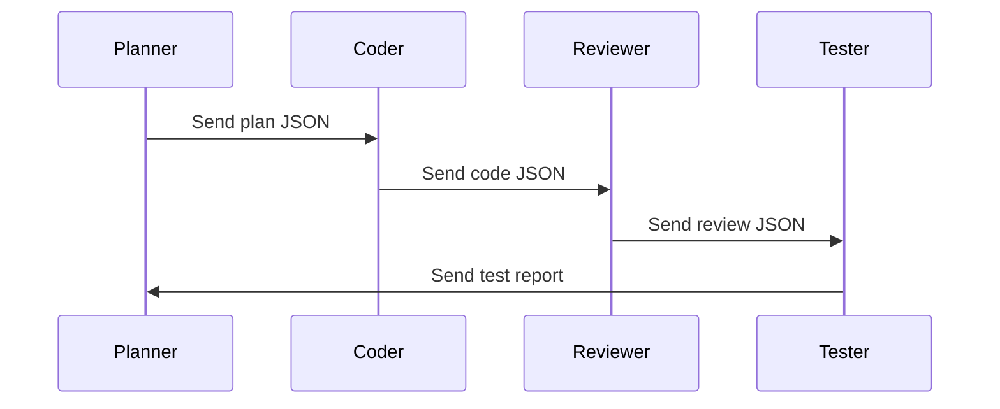

# Mermaid Diagrams & Speaker Notes

---

# 🧠 1. Agentic Architecture

---

# 🤖 2. Sub-Agent Flow

---

# 🔗 3. A2A Message Flow

---

# Speaker Notes

## Slide — LLM as Brain
Explain how LLM thinks but cannot remember.

## Slide — RAG as Memory Warehouse
Memory retrieval improves accuracy.

## Slide — Agents Feed the Brain
Agents deliver context + tools.

## Slide — Sub-Agents
Explain each role with real examples.

## Slide — A2A
Structured communication ensures consistency.

---
