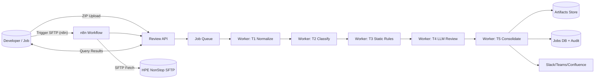
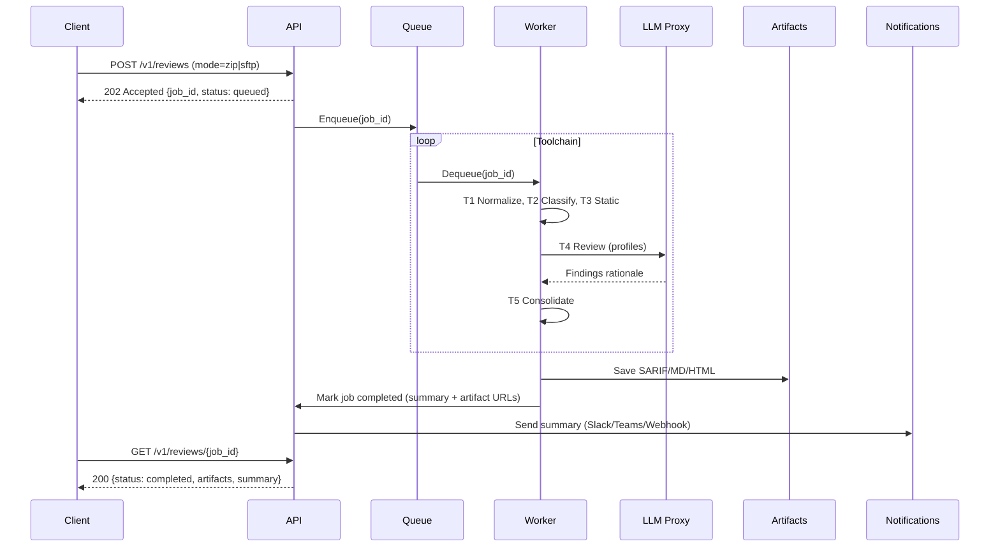

# Architecture & Diagrams

## Mermaid — Component Diagram

## Mermaid — Sequence (Respond after all tools complete)

## Artifacts & Data
- **Jobs DB**: job status, summary, config hash, model versions, audit.
- **Artifact Store**: `report.sarif.json`, `report.md`, `report.html`, `worker.log`, `traces.jsonl`.
- **Notifications**: Slack message with severity counts + top hotspots + artifact links.
